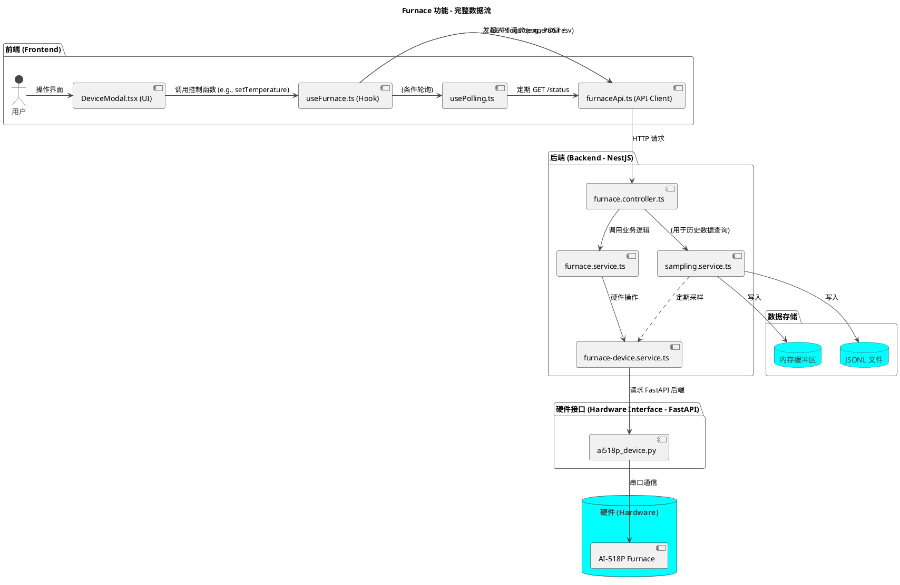

- version:2 update
# Furnace 功能技术文档

本文档详细介绍了 Furnace（加热炉）功能的完整技术栈，包括从前端用户界面到后端硬件控制的整个流程。

## 1. 整体架构

Furnace 功能采用三层架构设计：

1.  **前端 (React)**: 用户界面，负责与用户交互，展示数据和发送控制命令。
2.  **后端 (NestJS)**: 业务逻辑层，负责处理前端请求，管理设备状态、预设程序、数据采样和历史数据查询。
3.  **硬件接口 (Python FastAPI)**: 设备控制层，直接与 Furnace 硬件 (AI-518P) 通信，执行底层指令。

这种分层设计使得各部分职责清晰，易于维护和扩展。

## 2. 文件结构与职责

| 路径                                                        | 职责                                                                 |
| ----------------------------------------------------------- | -------------------------------------------------------------------- |
| `apps/frontend/src/components/DeviceModal.tsx`              | **前端 UI 组件**: 提供 Furnace 的所有用户交互界面，如状态监控、程序设置等。 |
| `apps/frontend/src/services/hooks/useFurnace.ts`            | **前端状态管理 (Hook)**: 封装 Furnace 的所有前端状态和控制逻辑。         |
| `apps/frontend/src/services/hooks/usePolling.ts`            | **通用轮询 Hook**: 提供可复用的轮询逻辑，用于定期获取设备状态。        |
| `apps/frontend/src/services/utils/apiUtils.ts`              | **API 工具库**: 提供 API 错误处理、重试等辅助函数。                   |
| `apps/frontend/src/services/api/furnaceApi.ts`              | **前端 API 客户端**: 封装所有对后端 Furnace API 的 HTTP 请求。             |
| `apps/backend/src/modules/furnace/furnace.controller.ts`    | **后端控制器 (Controller)**: 定义 `/api/devices/furnace` 的所有 API 路由。 |
| `apps/backend/src/modules/furnace/furnace.service.ts`       | **后端服务 (Service)**: 实现 Furnace 的核心业务逻辑，如预设管理。        |
| `apps/backend/src/modules/sampling/sampling.service.ts`     | **数据采样服务**: 负责定期从硬件采样数据，并提供历史数据查询。       |
| `apps/backend/src/devices/furnace-device.service.ts`        | **后端设备服务**: 作为 NestJS 和 FastAPI 之间的桥梁，转发硬件控制指令。 |
| `apps/backend/src/modules/furnace/fastapi/ai518p_device.py` | **硬件接口 (FastAPI)**: 提供底层的 HTTP 接口，直接与 AI-518P 温控仪通信。 |
| `packages/types/src/device.types.ts`                        | **共享类型定义**: 定义了前后端通用的 TypeScript 类型，如 `FurnaceStatus`。 |

## 3. 数据流与运行逻辑

### 3.1. 状态获取与轮询

1.  **UI (`DeviceModal.tsx`)** 通过 `useFurnace` Hook 获取实时状态 (`furnaceState.status`)。
2.  **Hook (`useFurnace.ts`)** 使用了 `useConditionalPolling` 这个自定义 Hook（来自 `usePolling.ts`）来定期获取状态。只有在 `connectionState.status` 为 `'connected'` 时，轮询才会启动。
3.  **Polling Hook (`usePolling.ts`)** 在满足条件时，会以固定的时间间隔（例如 2 秒）调用传入的 `fetchFn` 函数，即 `FurnaceApi.getStatus()`。它还使用 `apiUtils.ts` 中的函数来处理网络错误和重试逻辑。
4.  **API Client (`furnaceApi.ts`)** 发送 `GET /api/devices/furnace/status` 请求到后端。
5.  **Controller (`furnace.controller.ts`)** 接收请求，并调用 `furnace.service.ts` 的 `status()` 方法。
6.  **Service (`furnace.service.ts`)** 调用 `furnace-device.service.ts` 的 `status()` 方法。
7.  **Device Service (`furnace-device.service.ts`)** 发送 `GET /status` 请求到 FastAPI 应用。
8.  **FastAPI (`ai518p_device.py`)** 通过串口与 AI-518P 硬件通信，读取实时数据并返回。
9.  数据沿相反路径返回到前端 UI，完成状态更新。

### 3.2. 控制命令 (以“设置温度”为例)

1.  用户在 **UI (`DeviceModal.tsx`)** 中输入目标温度，点击按钮触发 `furnaceControls.setTemperature()`。
2.  **Hook (`useFurnace.ts`)** 调用 `FurnaceApi.setTemperature(sv)`。
3.  **API Client (`furnaceApi.ts`)** 发送 `POST /api/devices/furnace/sv` 请求，请求体为 `{ "sv": 450 }`。
4.  后续流程与状态获取类似，最终由 FastAPI 应用将指令发送到硬件。

### 3.3. 历史数据

1.  **数据采集**: `SamplingService` 在后端独立运行，每秒通过 `FurnaceDeviceService` 从硬件采集一次数据。
2.  **数据存储**: 采集到的数据点被追加到内存缓冲区（保留 1 小时）和当天的 JSONL 文件中 (`/apps/backend/data/samples/furnace/YYYY-MM-DD.jsonl`)。
3.  **数据查询**: 当用户在前端请求历史数据时，`furnaceApi.ts` 调用 `GET /api/devices/furnace/logs/temperature`。
4.  **Controller (`furnace.controller.ts`)** 将请求转发给 `SamplingService` 的 `queryFurnace` 方法。
5.  **`SamplingService`** 根据查询参数（时间范围、降采样率等），从内存和对应的 JSONL 文件中聚合数据，并返回给前端。

## 4. API 端点

所有 API 均以 `/api/devices/furnace` 为前缀。

| 方法   | 路径                      | 描述                               |
| ------ | ------------------------- | ---------------------------------- |
| `GET`  | `/status`                 | 获取设备实时状态                   |
| `POST` | `/sv`                     | 设置目标温度 (SV)                  |
| `POST` | `/segment/set`            | 设置当前程序段                     |
| `GET`  | `/program/segments`       | 获取所有程序段配置                 |
| `POST` | `/program/segments`       | 批量写入程序段配置                 |
| `GET`  | `/presets`                | 获取所有预设列表                   |
| `POST` | `/presets`                | 创建新预设                         |
| `GET`  | `/presets/:name`          | 获取指定名称的预设                 |
| `PUT`  | `/presets/:name`          | 更新指定预设                       |
| `DELETE`| `/presets/:name`          | 删除指定预设                       |
| `POST` | `/presets/:name/clone`    | 克隆预设                           |
| `POST` | `/presets/:name/apply`    | 应用预设到设备                     |
| `GET`  | `/logs/temperature`       | 查询历史温度数据                   |
| `POST` | `/connect`                | 连接设备                           |
| `POST` | `/disconnect`             | 断开设备连接                       |
| `POST` | `/run`                    | 运行程序                           |
| `POST` | `/pause`                  | 暂停程序                           |
| `POST` | `/stop`                   | 停止程序                           |

## 5. 流程图



## 6. 实现状态

### 6.1. FastAPI硬件接口层

**互斥锁实现**：
- 文件：`apps/backend/src/modules/furnace/fastapi/ai518p_device.py`
- 第7行：`import threading`
- 第49行：`self.lock = threading.Lock()`
- 第143行：`with self.lock:` 原子性操作
- 第131-182行：一发一收协议，独立超时机制

**数据契约对齐**：
- 状态字段：`run`/`pause`/`stop`
- 时间字段：`segment_time`、`segment_time_set`（秒）
- 请求体：`/sv{sv}`、`/segment/set{segment}`

### 6.2. NestJS后端业务层

**端口转发**：
- Controller第18行：`@Get('ports') ports()`
- Service第53行：`async ports()`
- 转发至FastAPI `/ports` 接口

**采样服务对齐**：
- 文件：`apps/backend/src/modules/sampling/sampling.service.ts`
- 第62-63行：读取 `st.segment_time`、`st.segment_time_set`
- 写入保持 `segmentTime`、`segmentTimeSet` 历史兼容

### 6.3. 前端React层

**数据字段**：
- 已使用 `segment_time`/`segment_time_set`（snake_case）
- DeviceModal.tsx第48行：`FurnaceApi.getPorts()`
- API请求体格式完全对齐

### 6.4. 验证方法

```bash
# 端口枚举
GET /api/devices/furnace/ports
# 响应：["COM1", "COM3", "COM4"]

# 连接设备
POST /api/devices/furnace/connect
# 请求体：{"port":"COM4","baudrate":9600,"address":1,"stopbits":2,"timeout":1.0}

# 状态查询
GET /api/devices/furnace/status
# 响应包含segment_time、segment_time_set（秒）和status字段
```

### 6.5. 实现状态
| 功能 | 状态 | 说明 |
|------|------|------|
| 数据契约对齐 | 完成 | 三层使用snake_case字段 |
| 串口原子性 | 完成 | threading.Lock + 一发一收 |
| 端口枚举 | 完成 | 前端可连接真实设备 |
**状态：生产就绪，支持真实设备联测。**