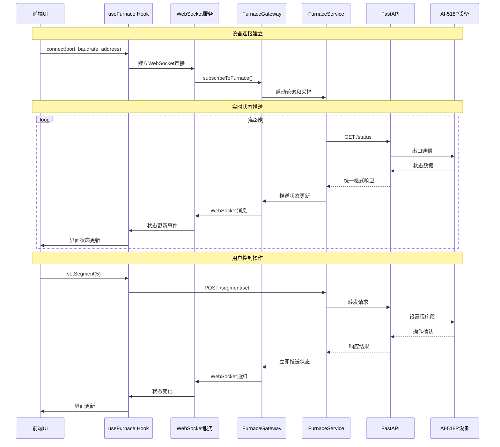

- version:2 update
# Furnace 功能技术文档

本文档详细介绍了 Furnace（加热炉）功能的完整技术栈，包括从前端用户界面到后端硬件控制的整个流程。

## 1. 整体架构

Furnace 功能采用三层架构设计：

1.  **前端 (React)**: 用户界面，负责与用户交互，展示数据和发送控制命令。
2.  **后端 (NestJS)**: 业务逻辑层，负责处理前端请求，管理设备状态、预设程序、数据采样和历史数据查询。
3.  **硬件接口 (Python FastAPI)**: 设备控制层，直接与 Furnace 硬件 (AI-518P) 通信，执行底层指令。

这种分层设计使得各部分职责清晰，易于维护和扩展。

## 2. 文件结构与职责

| 路径                                                        | 职责                                                                 |
| ----------------------------------------------------------- | -------------------------------------------------------------------- |
| `apps/frontend/src/components/furnace/`                     | **前端 UI 组件目录**: 包含StatusPanel、PresetManager、ConnectionPanel、ProgramEditor等组件 |
| `apps/frontend/src/services/hooks/useFurnace.ts`            | **前端状态管理 (Hook)**: 封装 Furnace 的所有前端状态和控制逻辑。         |
| `apps/frontend/src/services/furnace-websocket.service.ts`   | **WebSocket服务**: 处理实时数据推送和状态更新                        |
| `apps/frontend/src/services/api/furnaceApi.ts`              | **前端 API 客户端**: 封装所有对后端 Furnace API 的 HTTP 请求。             |
| `apps/backend/src/modules/furnace/furnace.controller.ts`    | **后端控制器 (Controller)**: 定义 `/api/devices/furnace` 的所有 API 路由。 |
| `apps/backend/src/modules/furnace/furnace.service.ts`       | **后端服务 (Service)**: 实现 Furnace 的核心业务逻辑，包含轮询和采样管理。        |
| `apps/backend/src/modules/furnace/furnace-data.service.ts`  | **数据管理服务**: 负责预设管理和历史数据存储查询。       |
| `apps/backend/src/modules/furnace/services/furnace-error-handler.service.ts` | **错误处理服务**: 提供熔断器和错误统计功能。 |
| `apps/backend/src/devices/furnace-device.service.ts`        | **后端设备服务**: 作为 NestJS 和 FastAPI 之间的桥梁，转发硬件控制指令。 |
| `apps/backend/src/gateways/furnace.gateway.ts`              | **WebSocket网关**: 处理前端WebSocket连接和实时数据推送。 |
| `apps/backend/src/modules/furnace/fastapi/ai518p_device.py` | **硬件接口 (FastAPI)**: 提供底层的 HTTP 接口，直接与 AI-518P 温控仪通信。 |
| `apps/frontend/src/types/devices.ts`                        | **类型定义**: 定义了前端通用的 TypeScript 类型，如 `FurnaceStatus`。 |

## 3. 数据流与运行逻辑

### 3.1. 状态获取与实时通信

1.  **UI组件** 通过 `useFurnace` Hook 获取实时状态并注册WebSocket监听器。
2.  **Hook (`useFurnace.ts`)** 管理设备连接状态，在连接时自动建立WebSocket连接并订阅设备状态更新。
3.  **WebSocket服务** 与后端 `FurnaceGateway` 建立持久连接，接收实时状态推送。
4.  **后端网关** 管理多客户端连接，通过轮询机制定期获取设备状态并推送给所有订阅的客户端。
5.  **Service (`furnace.service.ts`)** 包含轮询管理器，每2秒查询设备状态，每1秒进行数据采样。
6.  **Device Service** 转发请求到Python FastAPI服务。
7.  **FastAPI (`ai518p_device.py`)** 通过串口与AI-518P硬件通信，使用互斥锁确保原子性操作。
8.  **数据推送** 状态更新通过WebSocket实时推送到前端，减少HTTP轮询开销。

### 3.2. 控制命令流程

1.  **UI组件** 用户操作触发 `furnaceControls` 中的控制方法（如 `run`、`pause`、`stop`、`set_segment`）。
2.  **Hook (`useFurnace.ts`)** 调用相应的 `FurnaceApi` 方法，包含完整的参数验证和错误处理。
3.  **API Client** 发送POST请求到对应端点，请求体使用snake_case格式（如 `{ "segment": 5 }`）。
4.  **Controller** 接收请求并调用相应的Service方法，包含设备连接状态检查。
5.  **Service** 执行业务逻辑，在长时间操作期间暂停轮询，操作完成后恢复。
6.  **Device Service** 转发请求到FastAPI，支持动态超时设置。
7.  **FastAPI** 使用互斥锁执行原子性硬件操作，返回统一的响应格式。

### 3.3. 数据采集与存储

1.  **独立采样服务**: `FurnaceDataService` 在后端独立运行，每1秒通过 `FurnaceDeviceService` 从硬件采集一次数据。
2.  **内存缓冲**: 采集到的数据存储在内存缓冲区中，保留1小时的历史数据供快速查询。
3.  **文件存储**: 数据同时追加到当天的JSONL文件中 (`apps/backend/apps/backend/data/samples/furnace/YYYY-MM-DD.jsonl`)。
4.  **实时推送**: 采样数据通过WebSocket实时推送到前端，提供毫秒级的数据更新体验。
5.  **历史查询**: 前端可查询任意时间范围的历史数据，支持降采样以提高查询性能。
6.  **数据格式**: 统一使用snake_case字段（timestamp、temperature、sv、mv等）。

## 4. API 端点

所有 API 均以 `/api/devices/furnace` 为前缀。

### 4.1 设备控制接口

| 方法   | 路径                      | 描述                               |
| ------ | ------------------------- | ---------------------------------- |
| `POST` | `/connect`                | 连接设备（参数：port、baudrate、address、stopbits、timeout） |
| `POST` | `/disconnect`             | 断开设备连接                       |
| `GET`  | `/status`                 | 获取设备实时状态                   |
| `POST` | `/run`                    | 运行程序                           |
| `POST` | `/pause`                  | 暂停程序                           |
| `POST` | `/stop`                   | 停止程序                           |
| `POST` | `/segment/set`            | 设置当前程序段（参数：segment）    |
| `GET`  | `/program/segments`       | 获取所有程序段配置                 |
| `POST` | `/program/segments`       | 批量写入程序段配置                 |
| `GET`  | `/health`                 | 健康检查                           |
| `GET`  | `/ports`                  | 获取可用串口列表                   |
| `GET`  | `/comm-log`               | 获取通信日志                       |

### 4.2 预设管理接口

| 方法   | 路径                      | 描述                               |
| ------ | ------------------------- | ---------------------------------- |
| `GET`  | `/presets`                | 获取所有预设列表                   |
| `POST` | `/presets`                | 创建新预设（参数：name、segments、summary） |
| `GET`  | `/presets/:name`          | 获取指定名称的预设                 |
| `PUT`  | `/presets/:name`          | 更新指定预设                       |
| `DELETE`| `/presets/:name`          | 删除指定预设                       |
| `POST` | `/presets/:name/clone`    | 克隆预设（参数：newName）          |
| `POST` | `/presets/:name/apply`    | 应用预设到设备                     |

### 4.3 数据查询接口

| 方法   | 路径                      | 描述                               |
| ------ | ------------------------- | ---------------------------------- |
| `GET`  | `/logs/temperature`       | 查询历史温度数据（参数：from、to、limit、downsample） |

### 4.4 连接管理接口

| 方法   | 路径                      | 描述                               |
| ------ | ------------------------- | ---------------------------------- |
| `GET`  | `/connection/status`      | 获取连接状态                       |
| `POST` | `/connection/reconnect`   | 尝试重新连接                       |
| `GET`  | `/polling/status`         | 获取轮询状态                       |

### 4.5 错误处理接口

| 方法   | 路径                      | 描述                               |
| ------ | ------------------------- | ---------------------------------- |
| `GET`  | `/error/stats`            | 获取错误统计信息                   |
| `POST` | `/error/circuit-breaker/:name/reset` | 重置指定熔断器               |
| `POST` | `/error/circuit-breakers/reset` | 重置所有熔断器                 |
| `GET`  | `/error/recent`           | 获取最近的错误记录                 |
| `GET`  | `/error/export`           | 导出错误数据                       |
| `POST` | `/error/clear`            | 清理错误日志                       |

## 5. 数据流详解

### 5.1 WebSocket实时通信流程



### 5.2 数据采集与存储流程

```mermaid
flowchart TD
    A[FurnaceService采样管理器] --> B{每1秒触发}
    B --> C[调用DeviceService.status()]
    C --> D[FastAPI /status接口]
    D --> E[AI-518P串口通信]
    E --> F[获取PV/SV/MV/Segment数据]
    F --> G[FurnaceDataService处理]

    G --> H[内存缓冲区存储]
    G --> I[JSONL文件追加]
    G --> J[WebSocket实时推送]

    H --> K[1小时数据滚动]
    I --> L[按日期文件分割]
    J --> M[前端实时图表更新]

    N[前端历史查询] --> O[GET /logs/temperature]
    O --> P[数据聚合与降采样]
    P --> Q[返回时间序列数据]
```

## 6. 实现状态

### 6.1. Python FastAPI硬件接口层

**核心特性**：
- 文件：`apps/backend/src/modules/furnace/fastapi/ai518p_device.py`
- **线程安全**：使用`threading.Lock()`确保串口操作原子性
- **通信协议**：一发一收协议，独立超时机制防止阻塞
- **错误处理**：完整的异常分类（DEVICE、TIMEOUT、SYSTEM）
- **响应统一**：使用`FurnaceResponse`包装器确保格式一致
- **连接管理**：单连接模式，支持连接健康检查和自动重连

**API端点**：
- `/connect`、`/disconnect`：设备连接管理
- `/status`：实时状态查询
- `/run`、`/pause`、`/stop`：程序控制
- `/segment/set`：程序段设置
- `/program/segments`：程序段读写
- `/ports`：串口枚举
- `/health`、`/comm-log`：健康检查和通信日志

### 6.2. NestJS后端业务层

**服务架构**：
- **FurnaceService**：核心业务逻辑，包含轮询管理器（2秒间隔）和采样管理器（1秒间隔）
- **FurnaceDataService**：独立的数据管理服务，负责预设管理和历史数据存储
- **FurnaceErrorHandlerService**：错误处理服务，提供熔断器机制和错误统计
- **FurnaceGateway**：WebSocket网关，支持多客户端实时数据推送

**关键特性**：
- **条件轮询**：只在设备连接状态下启动轮询，节省资源
- **操作互斥**：长时间操作期间自动暂停轮询，避免冲突
- **连接管理**：完整的连接状态管理，支持重连机制
- **数据缓冲**：1小时内存缓冲 + JSONL文件持久化
- **预设管理**：完整的CRUD操作，支持克隆和应用

### 6.3. 前端React层

**组件结构**：
- **StatusPanel**：实时状态显示，包含PV、SV、MV数据
- **ConnectionPanel**：设备连接管理界面
- **ProgramEditor**：程序段编辑功能
- **PresetManager**：预设管理界面

**状态管理**：
- **useFurnace Hook**：封装所有前端状态和控制逻辑
- **WebSocket服务**：实时数据推送，自动重连机制
- **API客户端**：完整的参数验证和错误处理
- **数据格式**：严格使用snake_case命名规范

### 6.4. 数据验证

```bash
# 端口枚举测试
GET /api/devices/furnace/ports
# 响应：["COM1", "COM3", "COM4"]

# 设备连接测试
POST /api/devices/furnace/connect
# 请求体：{"port":"COM4","baudrate":9600,"address":1,"stopbits":2,"timeout":1.0}

# 状态查询测试
GET /api/devices/furnace/status
# 响应：{"pv":25.5,"sv":100.0,"mv":50,"status":"run","segment":1,"segment_time":120,"segment_time_set":300}

# 程序段操作测试
POST /api/devices/furnace/segment/set
# 请求体：{"segment":5}

# 预设管理测试
GET /api/devices/furnace/presets
# 响应：[{"name":"预热程序","createdAt":"2025-10-23T...","updatedAt":"2025-10-23T..."}]
```
