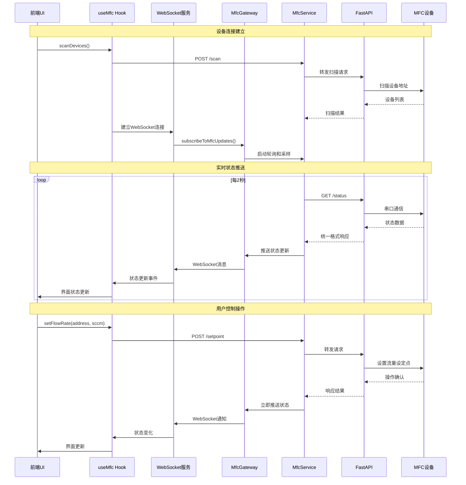

# MFC 功能技术文档

本文档详细介绍了 MFC（质量流量控制器）功能的完整技术栈，包括从前端用户界面到后端硬件控制的整个流程。

## 1. 整体架构

MFC 功能采用三层架构设计：

1.  **前端 (React)**: 用户界面，负责与用户交互，展示设备状态和流量数据，发送控制命令。
2.  **后端 (NestJS)**: 业务逻辑层，负责处理前端请求，管理设备连接状态、实时数据采集和历史数据查询。
3.  **硬件接口 (Python FastAPI)**: 设备控制层，直接与 MFC 硬件通信，执行底层指令。

这种分层设计使得各部分职责清晰，易于维护和扩展。

## 2. 文件结构与职责

| 路径                                                        | 职责                                                                 |
| ----------------------------------------------------------- | -------------------------------------------------------------------- |
| `apps/frontend/src/components/mfc/`                         | **前端 UI 组件目录**: 包含MFCDeviceCard、MFCModal等组件              |
| `apps/frontend/src/components/MFCDeviceCard.tsx`            | **设备卡片组件**: 显示单个MFC设备状态和控制界面                       |
| `apps/frontend/src/components/MFCModal.tsx`                 | **设备模态框**: 提供详细的设备管理和操作界面                         |
| `apps/frontend/src/services/hooks/useMfc.ts`                 | **前端状态管理 (Hook)**: 封装 MFC 的所有前端状态和控制逻辑。          |
| `apps/frontend/src/services/mfc-websocket.service.ts`       | **WebSocket服务**: 处理实时数据推送和状态更新                        |
| `apps/frontend/src/services/api/mfcApi.ts`                  | **前端 API 客户端**: 封装所有对后端 MFC API 的 HTTP 请求。             |
| `apps/backend/src/modules/mfc/mfc.controller.ts`            | **后端控制器 (Controller)**: 定义 `/api/devices/mfc` 的所有 API 路由。 |
| `apps/backend/src/modules/mfc/mfc.service.ts`               | **后端服务 (Service)**: 实现 MFC 的核心业务逻辑，包含轮询和采样管理。        |
| `apps/backend/src/modules/mfc/mfc-data.service.ts`          | **数据管理服务**: 负责流量历史数据管理、统计分析和数据持久化。       |
| `apps/backend/src/modules/mfc/services/mfc-error-handler.service.ts` | **错误处理服务**: 提供熔断器和错误统计功能。 |
| `apps/backend/src/devices/mfc-device.service.ts`            | **后端设备服务**: 作为 NestJS 和 FastAPI 之间的桥梁，转发硬件控制指令。 |
| `apps/backend/src/gateways/mfc.gateway.ts`                  | **WebSocket网关**: 处理前端WebSocket连接和实时数据推送。 |
| `apps/backend/src/modules/mfc/fastapi/mfc_device.py`        | **硬件接口 (FastAPI)**: 提供底层的 HTTP 接口，直接与 MFC 硬件通信。 |
| `apps/frontend/src/types/devices.ts`                        | **类型定义**: 定义了前端通用的 TypeScript 类型，如 `MfcDevice`、`MfcStatus`。 |

## 3. 数据流与运行逻辑

### 3.1. 状态获取与实时通信

1.  **UI组件** 通过 `useMfc` Hook 获取实时状态并注册WebSocket监听器。
2.  **Hook (`useMfc.ts`)** 管理设备连接状态，在连接时自动建立WebSocket连接并订阅设备状态更新。
3.  **WebSocket服务** 与后端 `MfcGateway` 建立持久连接，接收实时状态推送。
4.  **后端网关** 管理多客户端连接，通过轮询机制定期获取设备状态并推送给所有订阅的客户端。
5.  **Service (`mfc.service.ts`)** 包含轮询管理器，每2秒查询设备状态，每1秒进行数据采样。
6.  **Device Service** 转发请求到Python FastAPI服务。
7.  **FastAPI (`mfc_device.py`)** 通过串口与MFC硬件通信，使用互斥锁确保原子性操作。
8.  **数据推送** 状态更新通过WebSocket实时推送到前端，减少HTTP轮询开销。

### 3.2. 控制命令流程

1.  **UI组件** 用户操作触发 `mfcControls` 中的控制方法（如 `setFlowRate`、`setAllFlowRates`）。
2.  **Hook (`useMfc.ts`)** 调用相应的 `MfcApi` 方法，包含完整的参数验证和错误处理。
3.  **API Client** 发送POST请求到对应端点，请求体使用snake_case格式（如 `{ "address": 1, "sccm": 50.5 }`）。
4.  **Controller** 接收请求并调用相应的Service方法，包含设备连接状态检查。
5.  **Service** 执行业务逻辑，在长时间操作期间暂停轮询，操作完成后恢复。
6.  **Device Service** 转发请求到FastAPI，支持动态超时设置。
7.  **FastAPI** 使用互斥锁执行原子性硬件操作，返回统一的响应格式。

### 3.3. 数据采集与存储

1.  **独立采样服务**: `MfcDataService` 在后端独立运行，每1秒通过 `MfcDeviceService` 从硬件采集一次数据。
2.  **内存缓冲**: 采集到的数据存储在内存缓冲区中，保留10000条历史数据供快速查询。
3.  **实时推送**: 采样数据通过WebSocket实时推送到前端，提供毫秒级的数据更新体验。
4.  **历史查询**: 前端可查询任意时间范围的历史数据，支持降采样以提高查询性能。
5.  **数据格式**: 统一使用snake_case字段（timestamp、device_address、flow_sccm、setpoint_sccm等）。
6.  **错误统计**: 提供完整的通信日志记录和错误分类统计功能。

## 4. API 端点

所有 API 均以 `/api/devices/mfc` 为前缀。

### 4.1 设备控制接口

| 方法   | 路径                      | 描述                               |
| ------ | ------------------------- | ---------------------------------- |
| `POST` | `/connect`                | 连接设备（参数：port、baudrate、timeout） |
| `POST` | `/disconnect`             | 断开设备连接                       |
| `POST` | `/scan`                   | 扫描MFC设备地址（参数：start、end） |
| `GET`  | `/status`                 | 获取设备实时状态（参数：address）  |
| `POST` | `/setpoint`               | 设置流量设定点（参数：address、sccm） |
| `GET`  | `/health`                 | 健康检查                           |
| `GET`  | `/ports`                  | 获取可用串口列表                   |
| `GET`  | `/comm-log`               | 获取通信日志                       |
| `DELETE`| `/comm-log`              | 清空通信日志                       |

### 4.2 连接管理接口

| 方法   | 路径                      | 描述                               |
| ------ | ------------------------- | ---------------------------------- |
| `GET`  | `/connection/status`      | 获取连接状态                       |
| `GET`  | `/connection/info`        | 获取连接信息                       |

### 4.3 数据查询接口

| 方法   | 路径                      | 描述                               |
| ------ | ------------------------- | ---------------------------------- |
| `GET`  | `/logs/flow`              | 查询历史流量数据（参数：device_address、from、to、limit、downsample） |

### 4.4 错误处理接口

| 方法   | 路径                      | 描述                               |
| ------ | ------------------------- | ---------------------------------- |
| `GET`  | `/error/stats`            | 获取错误统计信息                   |
| `POST` | `/error/circuit-breaker/:name/reset` | 重置指定熔断器               |
| `GET`  | `/error/recent`           | 获取最近的错误记录                 |

## 5. 数据流详解

### 5.1 WebSocket实时通信流程



### 5.2 数据采集与存储流程

```mermaid
flowchart TD
    A[MfcService轮询管理器] --> B{每2秒触发}
    B --> C[调用DeviceService.status()]
    C --> D[FastAPI /status接口]
    D --> E[MFC串口通信]
    E --> F[获取流量/设定点数据]
    F --> G[MfcDataService处理]

    G --> H[内存缓冲区存储]
    G --> I[WebSocket实时推送]

    H --> J[10000条数据滚动]
    I --> K[前端实时图表更新]

    L[前端历史查询] --> M[GET /logs/flow]
    M --> N[数据聚合与降采样]
    N --> O[返回时间序列数据]
```

## 6. 实现状态

### 6.1. Python FastAPI硬件接口层

**核心特性**：
- 文件：`apps/backend/src/modules/mfc/fastapi/mfc_device.py`
- **线程安全**：使用`threading.Lock()`确保串口操作原子性
- **通信协议**：一发一收协议，独立超时机制防止阻塞
- **错误处理**：完整的异常分类（DEVICE、TIMEOUT、PROTOCOL、SYSTEM）
- **响应统一**：使用`MfcResponse`包装器确保格式一致
- **连接管理**：单连接模式，支持连接健康检查和自动重连
- **通信日志**：完整的通信日志记录和错误统计

**API端点**：
- `/connect`、`/disconnect`：设备连接管理
- `/scan`：设备地址扫描
- `/status`：实时状态查询
- `/setpoint`：流量设定点设置
- `/ports`：串口枚举
- `/health`、`/comm-log`：健康检查和通信日志
- `/connection/info`：连接信息获取

### 6.2. NestJS后端业务层

**服务架构**：
- **MfcService**：核心业务逻辑，包含轮询管理器（2秒间隔）和采样管理器（1秒间隔）
- **MfcDataService**：独立的数据管理服务，负责历史数据存储、统计分析和清理
- **MfcErrorHandlerService**：错误处理服务，提供熔断器机制和错误统计
- **MfcGateway**：WebSocket网关，支持多客户端实时数据推送

**关键特性**：
- **条件轮询**：只在设备连接状态下启动轮询，节省资源
- **操作互斥**：长时间操作期间自动暂停轮询，避免冲突
- **连接管理**：完整的连接状态管理，支持重连机制
- **数据缓冲**：10000条内存缓冲 + 自动清理机制
- **批量操作**：支持多设备同时设置流量
- **错误恢复**：熔断器机制和自动重试

### 6.3. 前端React层

**组件结构**：
- **MFCDeviceCard**：设备状态显示卡片，包含流量显示、设定控制和状态指示
- **MFCModal**：设备管理模态框，提供详细的操作界面

**状态管理**：
- **useMfc Hook**：封装所有前端状态和控制逻辑
- **WebSocket服务**：实时数据推送，自动重连机制
- **API客户端**：完整的参数验证和错误处理
- **数据格式**：严格使用snake_case命名规范

### 6.4. 数据验证

```bash
# 端口枚举测试
GET /api/devices/mfc/ports
# 响应：["COM1", "COM3", "COM4"]

# 设备连接测试
POST /api/devices/mfc/connect
# 请求体：{"port":"COM1","baudrate":19200,"timeout":1.0}

# 设备扫描测试
POST /api/devices/mfc/scan
# 请求体：{"start":32,"end":80}
# 响应：{"devices":[{"address":1,"gas_type":"N2","max_flow_sccm":1000}],"count":1}

# 状态查询测试
GET /api/devices/mfc/status
# 响应：{"devices":[{"device_address":1,"flow_percent":25.5,"flow_sccm":255.0,"digital_setpoint_percent":30.0,"active_setpoint_percent":30.0}]}

# 流量设置测试
POST /api/devices/mfc/setpoint
# 请求体：{"address":1,"sccm":500.0}

# 通信日志测试
GET /api/devices/mfc/comm-log
# 响应：{"logs":[{"timestamp":"12:34:56.789","direction":"TX","data":"01028003..."}],"total":50}
```

## 7. 核心数据字段

### 7.1 设备信息字段
- `device_address`: 设备地址
- `gas_type`: 气体类型
- `max_flow_sccm`: 最大流量值

### 7.2 状态数据字段
- `flow_percent`: 流量百分比
- `flow_sccm`: 实际流量值 (sccm)
- `digital_setpoint_percent`: 数字设定点百分比
- `active_setpoint_percent`: 活动设定点百分比
- `connection_status`: 连接状态
- `last_communication`: 最后通信时间

### 7.3 控制参数字段
- `address`: 设备地址
- `sccm`: 流量设定值
- `port`: 串口号
- `baudrate`: 波特率
- `timeout`: 超时时间
- `start`: 扫描起始地址
- `end`: 扫描结束地址

## 8. WebSocket消息类型

### 8.1 状态更新消息
```json
{
  "type": "status_update",
  "data": [
    {
      "device_address": 1,
      "flow_sccm": 255.0,
      "setpoint_sccm": 300.0,
      "gas_type": "N2",
      "max_flow_sccm": 1000,
      "connection_status": "connected",
      "last_communication": "2025-10-27T12:34:56.789Z"
    }
  ],
  "timestamp": "2025-10-27T12:34:56.789Z"
}
```

### 8.2 采样数据消息
```json
{
  "type": "sampling_data",
  "data": [
    {
      "device_address": 1,
      "timestamp": "2025-10-27T12:34:56.789Z",
      "flow_sccm": 255.0,
      "setpoint_sccm": 300.0
    }
  ],
  "timestamp": "2025-10-27T12:34:56.789Z"
}
```

### 8.3 连接状态更新消息
```json
{
  "type": "connection_update",
  "data": {
    "status": "connected",
    "device_count": 2,
    "connection_id": "uuid-string"
  },
  "timestamp": "2025-10-27T12:34:56.789Z"
}
```

## 9. 错误处理机制

### 9.1 错误分类
- **DEVICE**: 设备连接/通信错误
- **TIMEOUT**: 操作超时错误
- **PROTOCOL**: 协议解析错误
- **SYSTEM**: 系统级错误

### 9.2 熔断器机制
- 自动检测连续错误
- 达到阈值后暂停请求
- 支持手动重置
- 错误统计和监控

### 9.3 统一响应格式
```json
{
  "ok": false,
  "error_message": "设备通信超时",
  "error_category": "TIMEOUT",
  "retryable": true,
  "timestamp": "2025-10-27T12:34:56.789Z",
  "context": {}
}
```

## 10. 性能优化特性

### 10.1 数据管理优化
- 内存缓冲区限制（10000条记录）
- 定期数据清理（5分钟间隔）
- 降采样支持（大数据量查询优化）

### 10.2 通信优化
- 条件轮询（仅在连接时轮询）
- 批量操作支持
- WebSocket实时推送减少HTTP开销

### 10.3 错误恢复
- 自动重试机制
- 熔断器保护
- 连接健康检查

此文档提供了MFC模块的完整技术规范，涵盖了从前端UI到硬件接口的整个技术栈，为开发和维护提供了详细的参考指南。