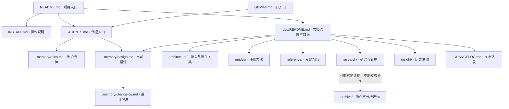

> Term / Thales 反编译材料已迁出至同级 `thales-reverse-engineering/`，不属于本项目文档或规则的管理范围。

# 项目文档架构与维护规则

状态：当前规则。归属：项目文档维护者；各模块修改者负责同步其相关文档。复核日期：2026-09-20。

本文是文档分类、归属和新增流程的唯一入口。运行架构由 [当前设计](../.memory/design.md) 维护；代码和文档的来源关系由 [来源登记与核查](architecture/source-of-truth.md) 维护。本文不另写一份运行架构。

## 目录与层级

```text
zahnerflow-main/
├── README.md                     项目介绍与导航
├── INSTALL.md                    当前安装、启动与构建操作
├── AGENTS.md                     代理工作入口、环境和提交约束
├── GEMINI.md                     旧工具入口，只指向 AGENTS.md
├── CHANGELOG.md                  应用版本发布记录
├── .memory/
│   ├── rules.md                  项目维护纪律与设计记录格式
│   ├── design.md                 当前架构与设计约束，按稳定锚点组织
│   └── changelog.md              设计变化的原因、影响与验证
├── doc/
│   ├── README.md                 文档架构、完整目录与新增规则（本页）
│   ├── architecture/
│   │   └── source-of-truth.md     功能源头、派生链与冲突核查
│   ├── guides/
│   │   └── cli-agent.md          CLI 使用方法
│   ├── reference/
│   │   ├── data-contracts.md     数据命名、单位、契约维护说明
│   │   └── design-system.md      视觉规范与样式维护说明
│   └── insight/
│       ├── 1.0.0/               该版本设计、审计、决策和复盘快照
│       └── 2.2.1/               优化前评估、过程和交付快照
└── .codex-run/                  已忽略的临时核查输出
```

`doc/` 是受版本管理的正文目录，不再并列建立 `docs/` 正文体系。已有忽略规则 `docs/api/` 仅表示可能的自动生成输出，不代表已存在或已实现生成流程。

## 文档架构图

箭头表示导航或职责归属，不表示代码生成。



## 各类文档的职责与归属

| 层级 / 类别 | 负责维护者 | 可以定义什么 | 不应承担什么 |
| --- | --- | --- | --- |
| 根入口 README | 项目维护者 | 产品概述、导航 | 复制完整安装手册、把历史建议列为当前需求 |
| 安装 INSTALL | 启动与打包模块维护者 | 经脚本核对的操作步骤 | 独立维护版本号、虚构测试命令 |
| 代理入口 AGENTS | 项目维护者 | 环境、提交、版本及必读入口 | 与专题规范维护两份不同规则 |
| 项目记忆 rules / design | 设计变更的实施者 | 更新纪律 / 当前设计约束 | 未实现愿景、逐行复述代码 |
| 来源登记 architecture | 涉及来源链的模块维护者 | 定义文件、生成步骤、消费者和已知问题 | 取代契约源码或生成器 |
| 使用说明 guides | 功能维护者 | 用户怎样使用当前功能 | 定义第二套 API、默认值或状态机 |
| 专题规范 reference | 契约 / 样式维护者 | 命名、单位、复用约束及其代码位置 | 手工复制整份生成类型、另定运行数值 |
| 研究 research | 研究任务负责人 | 有证据的结论、假设、验证缺口 | 宣布尚未接入的设备能力已可用 |
| 历史 insight / research/history | 归档者 | 当时的事实和决策背景 | 约束当前代码或自动创建待办 |
| 发布 / 设计日志 | 变更实施者 | 用户可见版本变化 / 设计原因 | 充当当前设计正文 |
| 本地材料 archive / 临时输出 | 研究或核查负责人 | 原件、哈希、工具输出、验证记录 | 作为克隆仓库后必然可用的文件 |

真实行为先核对代码；设计意图查 `.memory/design.md`。发现二者冲突时记录并修正过期文档，不可用历史文档覆盖当前实现，也不可借代码现状静默取消明确的维护约束。

## 当前目录

- 当前设计：[设计锚点](../.memory/design.md)、[维护纪律](../.memory/rules.md)、[来源登记与核查](architecture/source-of-truth.md)。
- 使用：[安装启动](../INSTALL.md)、[CLI 与 Agent](guides/cli-agent.md)。
- 规范：[数据与命名](reference/data-contracts.md)、[视觉与样式](reference/design-system.md)。
- 历史：[1.0.0 归档](insight/1.0.0/README.md)、[2.2.1 归档](insight/2.2.1/README.md)。
- 变化：[发布日志](../CHANGELOG.md)、[设计演进](../.memory/changelog.md)。

## 新增与维护流程

1. 先查本目录和来源登记。已有主题更新原文；只有独立读者任务或独立证据范围才新增文件。默认不要新增根目录文档。
2. 选择上表唯一主类别，并在正文开头写明“状态、归属、来源、复核日期”。状态使用“当前规则 / 当前使用说明 / 研究结论 / 历史快照 / 派生产物”。研究结论必须分开写已证实、推断和待验证。
3. 定义事实只维护一处。正文链接源码路径和符号；版本、契约、默认值等可变数值优先指向定义。确需摘录时标明复核日期、来源和更新触发条件，不把摘录称为源头。
4. 目录结构用文本 tree。架构、依赖和来源图使用 Mermaid；箭头注明“生成、导入、调用、存储、展示或引用”，手工同步不能画成自动生成。
5. 改动定义时沿 [来源链](architecture/source-of-truth.md) 检查消费者和生成步骤，先改定义再生成。不要直接修补生成类型、构建输出、报告或缓存来改变功能。
6. 改变架构、接口、设备、启动或持久化时，同步 `.memory/design.md` 对应锚点，并在 `.memory/changelog.md` 追加原因、变更、设计影响和验证。只修改文档目录也要维护 `[文档-架构与来源]`。
7. 研究转为实现须有代码、验证和设计锚点；不能只移动研究报告或改标题。结论被替代时原文加“已替代”及新入口，再放入 `history/`，保留当时证据。
8. 新增文件登记到本目录或其专题 README。移动文件时修复 Markdown 链接和正文路径；历史内容仅修复路径、状态说明和明确勘误，保留当时结论。
9. 完成前检查链接、Mermaid 语法、引用文件和符号、生成关系、设计锚点、版本策略及 Git 差异。核查工具输出放忽略目录。按项目规则提交，不混入其他任务的改动。

新文档开头可使用：`状态：当前使用说明。归属：CLI 维护者。来源：apps/zahnerflow_cli/。复核日期：YYYY-MM-DD。` 自动生成文档还必须注明生成器、命令、输入和“勿手改”。
