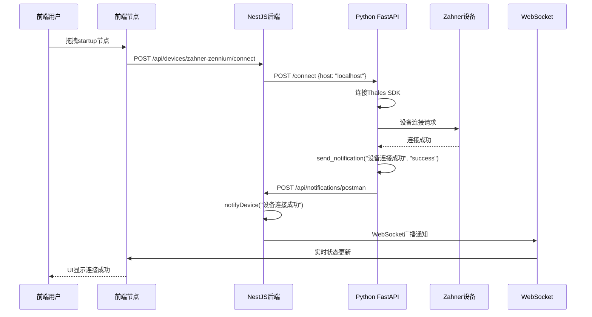
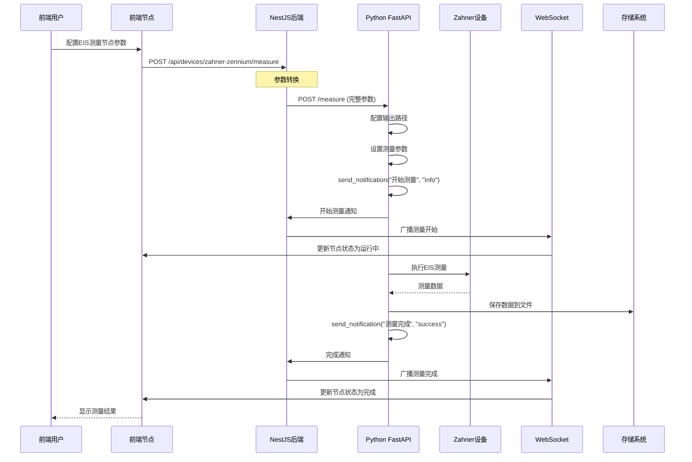
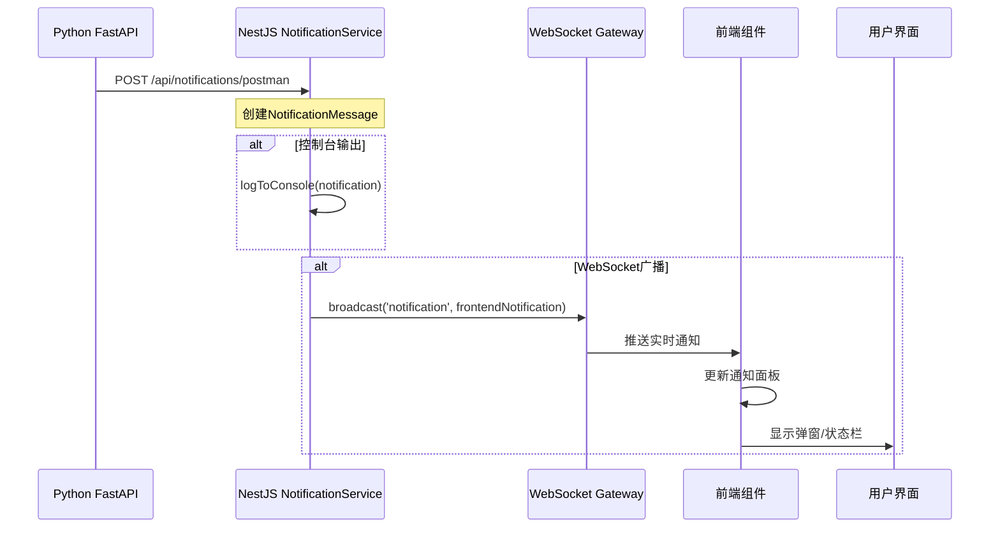

# ZahnerFlow Zahner 设备控制流程文档

## 概述

本文档详细描述了 ZahnerFlow 系统中 Zahner 电化学设备从 Python 后端脚本到前端节点的完整功能传动流程，涵盖了从设备控制到用户界面的整个数据流转过程。

## 系统架构

```
┌─────────────────┐    HTTP/JSON    ┌─────────────────┐    WebSocket     ┌─────────────────┐
│   Python FastAPI│◄──────────────►│   NestJS后端    │◄──────────────►│   前端界面      │
│  (zahner_device.py)│               │                 │               │                 │
│                 │               │                 │               │                 │
│ - 设备连接管理   │               │ - 设备服务层     │               │ - 节点编辑器    │
│ - EIS测量执行   │               │ - 通知服务       │               │ - 工作流执行    │
│ - 状态监控      │               │ - 执行引擎       │               │ - 实时通知      │
└─────────────────┘               └─────────────────┘               └─────────────────┘
         │                                 │                                 │
         │            ┌─────────────────┐            │                 ┌─────────────────┐
         │            │   Zahner SDK   │            │                 │   数据存储      │
         └────────────►│   (Thales)     │◄───────────┘                 │                 │
                      │                 │                              │ - 工作流定义    │
                      │ - 设备控制      │                              │ - 执行历史      │
                      │ - 数据采集      │                              │ - 测量数据      │
                      └─────────────────┘                              └─────────────────┘
```

## 1. Python 设备层 (zahner_device.py)

### 1.1 核心功能

**文件位置**: `apps/backend/scripts/zahner_device.py`

**主要职责**:
- 提供FastAPI服务接口控制Zahner设备
- 与Thales SDK通信实现设备控制
- 执行EIS测量并保存数据
- 向NestJS后端发送实时通知

**服务配置**:
```python
# 服务启动
uvicorn.run(app, host="0.0.0.0", port=8000)

# 后端通知URL
BACKEND_NOTIFICATION_URL = "http://localhost:3001/api/notifications/postman"

# CORS配置
allow_origins=["http://localhost:8083", "http://localhost:8081",
               "http://localhost:3000", "http://127.0.0.1:8083"]
```

### 1.2 设备控制API

#### 连接管理
```python
@app.post("/connect")
def connect(request: ConnectRequest):
    return connect_device(request.host)

@app.post("/disconnect")
def disconnect():
    return disconnect_device()

@app.get("/status")
def status():
    return get_status()
```

#### 测量执行
```python
@app.post("/measure")
def measure(request: MeasureRequest):
    return measure_eis(request.dict())

@app.post("/configure-output")
def configure_output(request: OutputConfig):
    return configure_eis_output(request.dict())
```

#### 设备选项
```python
@app.get("/options")
def get_options():
    """获取可用的枚举选项"""
    return {
        "potentiostat_modes": list(AVAILABLE_POTENTIOSTAT_MODES.keys()),
        "scan_directions": list(AVAILABLE_SCAN_DIRECTIONS.keys()),
        "scan_strategies": list(AVAILABLE_SCAN_STRATEGIES.keys()),
        "naming_modes": list(AVAILABLE_NAMING_MODES.keys())
    }
```

### 1.3 通知机制

**关键函数**: `send_notification()`

```python
def send_notification(title: str, message: str, notification_type: str = "info", source: str = "zahner-device"):
    """发送通知到NestJS后端"""
    notification_data = {
        "title": title,
        "message": message,
        "type": notification_type,
        "source": source,
        "timestamp": int(time.time() * 1000)
    }

    response = requests.post(
        BACKEND_NOTIFICATION_URL,
        json=notification_data,
        timeout=5
    )
```

**通知触发点**:
- 设备连接/断开
- 测量开始/完成/失败
- 配置更改
- 错误状态

### 1.4 测量参数映射

**EIS测量参数**:
```python
class MeasureRequest(BaseModel):
    # 输出配置（必需）
    output_config: OutputConfig

    # 基本测量参数
    start_frequency: float = 100000
    end_frequency: float = 0.1
    amplitude: float = 0.01
    points_per_decade: int = 10
    potential: float = 1.0

    # 频率参数
    lower_frequency_limit: float = 10
    upper_frequency_limit: float = 10000
    start_frequency_custom: float = 1000

    # 测量参数
    lower_number_of_periods: int = 5
    upper_number_of_periods: int = 20
    lower_steps_per_decade: int = 2
    upper_steps_per_decade: int = 5

    # 扫描配置
    scan_direction: str = "START_TO_MAX"
    scan_strategy: str = "SINGLE_SINE"
    potentiostat_mode: str = "POTMODE_POTENTIOSTATIC"
```

## 2. NestJS 后端层

### 2.1 ZahnerZenniumService

**文件位置**: `apps/backend/src/modules/zahner-zennium/zahner-zennium.service.ts`

**核心功能**:
- 封装Python FastAPI接口调用
- 管理设备连接状态
- 参数转换和错误处理
- 集成通知系统

**关键方法**:
```typescript
// 设备连接
async connect(): Promise<void> {
  const result = await this.makeRequest<any>('POST', '/connect', {
    host: process.env.ZAHNER_DEVICE_HOST || 'localhost'
  });
}

// 测量执行
async executeMeasurement(measurement: any): Promise<MeasurementResult> {
  const fastApiMeasurement = {
    output_config: {
      output_path: measurement.outputPath || '/tmp/eis_data',
      naming_mode: measurement.fileNaming || 'COUNTER',
      counter: measurement.counter || 1,
      filename: measurement.outputFileName || 'eis_data'
    },
    // ... 参数转换
  };

  return await this.makeRequest<any>('POST', '/measure', fastApiMeasurement);
}
```

### 2.2 ZahnerZenniumController

**文件位置**: `apps/backend/src/modules/zahner-zennium/zahner-zennium.controller.ts`

**API端点**:
```typescript
@Controller('api/devices/zahner-zennium')
export class ZahnerZenniumController {
  @Post('connect')     // 设备连接
  @Post('disconnect')  // 设备断开
  @Get('status')       // 状态查询
  @Post('measure')      // 测量执行
  @Post('calibrate')    // 设备校准
  @Get('capabilities') // 能力查询
}
```

### 2.3 NotificationService

**文件位置**: `apps/backend/src/notification/notification.service.ts`

**通知分级**:
- **用户通知**: SYSTEM, WORKFLOW, DEVICE, OPERATION, ERROR
- **调试通知**: EXECUTION_DETAIL, STATE_CHANGE, NETWORK, PERFORMANCE, INTERNAL

**设备相关通知方法**:
```typescript
notifyDevice(message: string, details?: string): void   // 设备状态变化
notifyOperation(message: string, details?: string): void // 操作执行
notifyError(message: string, details?: string): void    // 错误情况
```

**通知转发**:
1. **控制台输出**: 本地日志记录
2. **WebSocket广播**: 实时推送到前端
3. **外部集成**: Python脚本发送的通知

## 3. 前端节点层

### 3.1 节点类型定义

**文件位置**: `apps/frontend/src/nodes/types.ts`

**Zahner专用节点**:
```typescript
export type ZahnerNodeType =
  | 'startup'         // 启动程序
  | 'shutdown'        // 停止程序
  | 'eis_measurement'; // EIS测量

export const ZAHNER_NODE_CONFIGS: Record<ZahnerNodeType, NodeConfig> = {
  startup: {
    type: 'startup',
    name: '启动程序',
    description: '启动电化学工作站程序 (FastAPI)',
    defaultParameters: {
      host: 'localhost',
      workstation: 'zahner-zennium'
    }
  },

  eis_measurement: {
    type: 'eis_measurement',
    name: 'EIS测量',
    description: '电化学阻抗谱测量 (FastAPI)',
    defaultParameters: {
      outputPath: '/tmp/eis_data',
      startFrequency: 100000,
      endFrequency: 0.1,
      amplitude: 0.01,
      // ... 完整参数列表
      workstation: 'zahner-zennium'
    }
  }
};
```

### 3.2 设备服务

**文件位置**: `apps/frontend/src/services/deviceService.ts`

**Zahner专用API**:
```typescript
export const zahnerService = {
  // 设备状态
  getStatus(): Promise<DeviceStatus> {
    return apiHelpers.get('/devices/zahner-zennium/status');
  },

  // EIS测量
  performEIS(params: EISParams): Promise<MeasurementResult> {
    return apiHelpers.post('/devices/zahner-zennium/eis', params);
  },

  // 数据获取
  getMeasurementData(measurementId: string): Promise<MeasurementData> {
    return apiHelpers.get(`/devices/zahner-zennium/measurements/${measurementId}`);
  }
};
```

**通用设备API**:
```typescript
export const deviceService = {
  connectDevice(deviceType: string, config?: DeviceConfig): Promise<ConnectResult> {
    return apiHelpers.post(`/devices/${deviceType}/connect`, config);
  },

  disconnectDevice(deviceType: string, deviceId?: string): Promise<void> {
    return apiHelpers.post<void>(`/devices/${deviceType}/disconnect`, { deviceId });
  }
};
```

## 4. 完整数据流转流程

### 4.1 设备连接流程



### 4.2 EIS测量执行流程



### 4.3 实时通知流程



## 5. 错误处理机制

### 5.1 连接层错误

**Python层**:
```python
try:
    device_connection.connectToTerm(host)
    send_notification("设备连接成功", "success")
except Exception as e:
    send_notification(f"设备连接失败: {str(e)}", "error")
    return {"success": False, "error": str(e)}
```

**NestJS层**:
```typescript
try {
  const result = await this.makeRequest<any>('POST', '/connect');
  if (!result.success) {
    this.logger.error(`设备连接失败: ${result.error}`);
    throw new Error(result.error);
  }
} catch (error) {
  this.logger.error(`连接异常: ${error.message}`);
  throw error;
}
```

### 5.2 测量层错误

**超时处理**:
```typescript
private readonly timeoutMs = 30000;

private async makeRequest<T>(method: string, path: string, data?: any): Promise<T> {
  try {
    const response = await firstValueFrom(
      this.httpService.post(`${this.baseUrl}${path}`, data, config)
        .pipe(timeout(this.timeoutMs))
    );
    return response.data;
  } catch (error) {
    if (error.code === 'ECONNREFUSED') {
      throw new Error(`FastAPI服务器连接失败: ${error.message}`);
    }
    throw error;
  }
}
```

**设备状态检查**:
```typescript
async executeMeasurement(measurement: any): Promise<MeasurementResult> {
  if (!this.isConnected) {
    try {
      await this.connect();  // 自动重连
    } catch (error) {
      return {
        success: false,
        error: '设备连接失败，无法执行测量'
      };
    }
  }
  // 执行测量...
}
```

## 6. 配置管理

### 6.1 环境变量配置

**NestJS后端**:
```typescript
// FastAPI服务器地址
this.baseUrl = process.env.ZAHNER_FASTAPI_URL || 'http://localhost:8000';

// 设备主机地址
host: process.env.ZAHNER_DEVICE_HOST || 'localhost'
```

**Python服务**:
```python
# 后端通知URL
BACKEND_NOTIFICATION_URL = "http://localhost:3001/api/notifications/postman"

# CORS允许的源
allow_origins=["http://localhost:8083", "http://localhost:8081",
               "http://localhost:3000", "http://127.0.0.1:8083"]
```

### 6.2 节点参数配置

**前端节点默认参数**:
```typescript
defaultParameters: {
  outputPath: '/tmp/eis_data',
  startFrequency: 100000,
  endFrequency: 0.1,
  amplitude: 0.01,
  pointsPerDecade: 10,
  potential: 1.0,
  // ... 更多参数
  workstation: 'zahner-zennium'
}
```

## 7. 部署和运行


### 7.2 端口配置

| 服务 | 端口 | 用途 |
|------|------|------|
| Python FastAPI | 8000 | 设备控制和测量 |
| NestJS后端 | 3001 | 业务逻辑和API |
| 前端应用 | 8083 | 用户界面 |
| WebSocket | 3001 | 实时通信 |

### 7.3 健康检查

**FastAPI健康检查**:
```bash
curl http://localhost:8000/health
```

**Zahner设备状态**:
```bash
curl http://localhost:8000/status
```

**后端服务状态**:
```bash
curl http://localhost:3001/api/devices/zahner-zennium/status
```

## 8. 扩展指南

### 8.1 添加新的测量类型

#### 四层架构流程
添加新的测量类型需要遵循系统的四层架构模式：

```
前端节点层 → NestJS服务层 → FastAPI接口层 → Python设备层
```

#### 抽象实现步骤

**1. Python设备层扩展**
- 在`zahner_device.py`中添加新的测量函数
- 扩展`MeasurementRequest`数据模型
- 更新统一测量接口和选项枚举
- 实现错误处理和通知机制

**2. FastAPI接口层扩展**
- 添加新的测量类型到枚举
- 更新选项接口支持新参数
- 确保API接口向后兼容

**3. NestJS服务层扩展**
- 在`ZahnerZenniumService`中添加对应的测量方法
- 更新接口定义和数据模型
- 实现参数验证和错误处理

**4. 前端节点层扩展**
- 在`types.ts`中添加新的节点类型
- 配置节点属性、样式和默认参数
- 更新节点分组和参数面板支持
- 适配执行引擎

**5. 执行引擎适配**
- 更新测量执行逻辑
- 添加新的测量类型处理分支
- 确保结果格式化统一

**6. 测试验证**
- Python API接口测试
- 前端节点功能测试
- 端到端集成测试
- 参数验证和错误处理测试

#### 关键原则

1. **参数命名一致性**: 所有层次使用相同的snake_case参数名
2. **错误处理**: 每层都有完善的错误处理和通知机制
3. **类型安全**: 使用TypeScript接口确保参数类型安全
4. **向后兼容**: 新功能不破坏现有功能
5. **统一接口**: 遵循现有的API设计和数据格式
6. **测试覆盖**: 为新功能编写完整的测试用例

#### 可扩展的测量类型

系统架构支持添加任意测量类型：
- 恒电流测量 (CC)
- 开路电位测量 (OCP)
- 计时安培法 (CA)
- 计时电位法 (CP)
- 其他自定义测量方法

每种测量都遵循相同的四层架构模式，确保系统的一致性和可维护性。

## 9. 完整实现示例：添加恒电流测量(CC)

为了更好地理解上述流程，这里提供一个完整的恒电流测量(CC)实现示例。

### 9.1 Python设备层实现

#### 9.1.1 添加CC测量函数
```python
def measure_cc(params):
    """恒电流测量 - 包含完整参数和输出配置"""
    global device_wrapper

    if not device_wrapper:
        error_msg = "设备未连接"
        send_notification("CC测量", error_msg, "error", "zahner_device.py:measure_cc")
        return {"success": False, "error": error_msg}

    try:
        send_notification("CC测量", "开始执行恒电流测量...", "info", "zahner_device.py:measure_cc")

        # 验证必需参数
        output_path = params.get("output_path")
        if not output_path:
            error_msg = "缺少必需参数: output_path"
            send_notification("CC测量", error_msg, "error", "zahner_device.py:measure_cc")
            return {"success": False, "error": error_msg}

        current = params.get("current")
        if current is None:
            error_msg = "缺少必需参数: current"
            send_notification("CC测量", error_msg, "error", "zahner_device.py:measure_cc")
            return {"success": False, "error": error_msg}

        duration = params.get("duration")
        if duration is None:
            error_msg = "缺少必需参数: duration"
            send_notification("CC测量", error_msg, "error", "zahner_device.py:measure_cc")
            return {"success": False, "error": error_msg}

        # 配置输出
        device_wrapper.setCCOutputPath(output_path)
        naming_mode = AVAILABLE_NAMING_MODES.get(params.get("naming_mode", "COUNTER"))
        if naming_mode:
            device_wrapper.setCCNaming(naming_mode)
        device_wrapper.setCCOutputFileName(params.get("filename", "cc_data"))

        # 设置恒电位仪模式为恒电流模式
        device_wrapper.setPotentiostatMode(PotentiostatMode.POTMODE_GALVANOSTATIC)

        # 设置CC测量参数
        device_wrapper.setCurrent(current)  # 施加电流 (A)
        device_wrapper.setDuration(duration)  # 测量时长 (s)
        device_wrapper.setSamplingInterval(params.get("sampling_interval", 0.1))  # 采样间隔 (s)

        # 执行测量
        device_wrapper.enablePotentiostat()
        device_wrapper.measureCC()
        device_wrapper.disablePotentiostat()

        success_msg = "CC测量完成，数据已保存到输出文件"
        send_notification("CC测量", success_msg, "success", "zahner_device.py:measure_cc")

        return {
            "success": True,
            "data": {
                "message": success_msg,
                "output_path": output_path,
                "parameters": params
            }
        }
    except Exception as e:
        error_msg = f"CC测量失败: {str(e)}"
        send_notification("CC测量", error_msg, "error", "zahner_device.py:measure_cc")
        return {"success": False, "error": error_msg}
```

#### 9.1.2 更新MeasurementType枚举
```python
class MeasurementType(str, Enum):
    EIS = "eis"
    CV = "cv"
    CC = "cc"  # 添加恒电流测量
```

#### 9.1.3 更新统一测量接口
```python
@app.post("/measure")
def measure(request: MeasurementRequest):
    """统一测量接口"""
    if request.measurement_type == MeasurementType.EIS:
        return measure_eis(request.parameters)
    elif request.measurement_type == MeasurementType.CV:
        return measure_cv(request.parameters)
    elif request.measurement_type == MeasurementType.CC:
        return measure_cc(request.parameters)
    else:
        return {"success": False, "error": f"不支持的测量类型: {request.measurement_type}"}
```

### 9.2 NestJS服务层实现

#### 9.2.1 添加CC测量方法
```typescript
async executeCCMeasurement(ccParams: any): Promise<MeasurementResult> {
    this.logger.log('执行CC测量...');

    if (!this.isConnected) {
        return await this.handleDisconnectedDevice('CC测量');
    }

    try {
        const ccMeasurement = {
            measurement_type: 'cc',
            parameters: ccParams
        };

        const result = await this.makeRequest<any>('POST', '/measure', ccMeasurement);

        if (result.success) {
            this.logger.log('CC测量完成');
            return this.createSuccessResult(result.data);
        } else {
            this.logger.error(`CC测量失败: ${result.error}`);
            return this.createErrorResult(result.error);
        }
    } catch (error) {
        return this.handleException(error, 'CC测量');
    }
}

// 辅助方法
private async handleDisconnectedDevice(measurementType: string): Promise<MeasurementResult> {
    this.logger.warn('设备未连接，尝试自动连接...');
    try {
        await this.connect();
    } catch (error) {
        return {
            success: false,
            data: null,
            error: '设备连接失败，无法执行测量',
            metadata: this.createMetadata()
        };
    }
}

private createSuccessResult(data: any): MeasurementResult {
    return {
        success: true,
        data: data,
        metadata: this.createMetadata()
    };
}

private createErrorResult(error: string): MeasurementResult {
    return {
        success: false,
        data: null,
        metadata: this.createMetadata(),
        error: error
    };
}

private handleException(error: any, measurementType: string): MeasurementResult {
    this.logger.error(`${measurementType}异常: ${error.message}`);
    return {
        success: false,
        data: null,
        metadata: this.createMetadata(),
        error: error.message
    };
}

private createMetadata(): any {
    return {
        startTime: new Date(),
        endTime: new Date(),
        duration: 0,
        device: 'ZENNIUM'
    };
}
```

### 9.3 前端节点层实现

#### 9.3.1 添加CC节点配置
```typescript
cc_measurement: {
    type: 'cc_measurement',
    name: 'CC测量',
    category: 'basic_measurement',
    description: '恒电流测量 (FastAPI)',
    icon: '⚡',
    input: {
        id: 'input',
        name: '输入',
        dataType: 'flow',
        description: '流程输入'
    },
    output: {
        id: 'output',
        name: '输出',
        dataType: 'data',
        description: 'CC数据输出'
    },
    style: {
        width: 160,
        height: 60,
        background: 'linear-gradient(135deg, #4ECDC4, #44A08D)',
        borderColor: '#44A08D',
        borderRadius: '8px',
        textColor: '#ffffff',
        icon: '⚡'
    },
    defaultParameters: {
        output_path: '/tmp/cc_data',         // 输出文件路径 (必需)
        current: 0.001,                     // 施加电流 (A)
        duration: 60,                       // 测量时长 (s)
        sampling_interval: 0.1,             // 采样间隔 (s)
        filename: 'cc_data',                 // 输出文件名
        naming_mode: 'COUNTER',              // 文件命名方式
        counter: 1                           // 计数器起始值
    }
}
```

#### 9.3.2 更新执行引擎
```typescript
async executeMeasurement(node: ElectrochemicalNode): Promise<ExecutionResult> {
    try {
        let result;

        switch (node.type) {
            case 'eis_measurement':
                result = await this.zahnerService.executeMeasurement(node.data.parameters);
                break;
            case 'cv_measurement':
                result = await this.zahnerService.executeCVMeasurement(node.data.parameters);
                break;
            case 'cc_measurement':
                result = await this.zahnerService.executeCCMeasurement(node.data.parameters);
                break;
            default:
                throw new Error(`不支持的测量类型: ${node.type}`);
        }

        return this.formatExecutionResult(result, node.id);
    } catch (error) {
        return this.formatExecutionError(error, node.id);
    }
}

private formatExecutionResult(result: any, nodeId: string): ExecutionResult {
    return {
        success: result.success,
        nodeId: nodeId,
        data: result.data,
        error: result.error,
        timestamp: new Date()
    };
}

private formatExecutionError(error: any, nodeId: string): ExecutionResult {
    return {
        success: false,
        nodeId: nodeId,
        error: error.message,
        timestamp: new Date()
    };
}
```

### 9.4 参数验证和类型安全

#### 9.4.1 添加参数验证接口
```typescript
// 在interfaces/validation-interfaces.ts中
export interface CCMeasurementParams {
    output_path: string;
    current: number;
    duration: number;
    sampling_interval?: number;
    filename?: string;
    naming_mode?: string;
    counter?: number;
}

export class MeasurementValidator {
    static validateCCParams(params: any): { valid: boolean; errors: string[] } {
        const errors: string[] = [];

        if (!params.output_path || typeof params.output_path !== 'string') {
            errors.push('output_path必须是有效的字符串');
        }

        if (params.current === undefined || typeof params.current !== 'number') {
            errors.push('current必须是有效的数字');
        } else if (Math.abs(params.current) > 1) {
            errors.push('current绝对值不能超过1A');
        }

        if (params.duration === undefined || typeof params.duration !== 'number') {
            errors.push('duration必须是有效的数字');
        } else if (params.duration <= 0 || params.duration > 3600) {
            errors.push('duration必须在0-3600秒之间');
        }

        if (params.sampling_interval !== undefined &&
            (typeof params.sampling_interval !== 'number' || params.sampling_interval <= 0)) {
            errors.push('sampling_interval必须是大于0的数字');
        }

        return {
            valid: errors.length === 0,
            errors
        };
    }
}
```


### 9.6 部署和验证清单

#### 9.6.1 部署前检查清单
- [ ] Python函数语法检查通过
- [ ] FastAPI接口更新完成
- [ ] NestJS服务方法添加完成
- [ ] 前端节点配置添加完成
- [ ] 参数验证逻辑实现
- [ ] 错误处理机制完善
- [ ] 通知机制正常工作
- [ ] 单元测试编写完成
- [ ] 集成测试通过
- [ ] API文档更新

#### 9.6.2 部署后验证清单
- [ ] Python服务重启成功
- [ ] 新的测量类型在/options中可见
- [ ] 后端服务构建成功
- [ ] 前端应用重启成功
- [ ] 新节点在面板中显示
- [ ] 参数编辑功能正常
- [ ] 测量执行功能正常
- [ ] 结果数据显示正常
- [ ] 实时通知正常接收
- [ ] 数据文件正确生成

