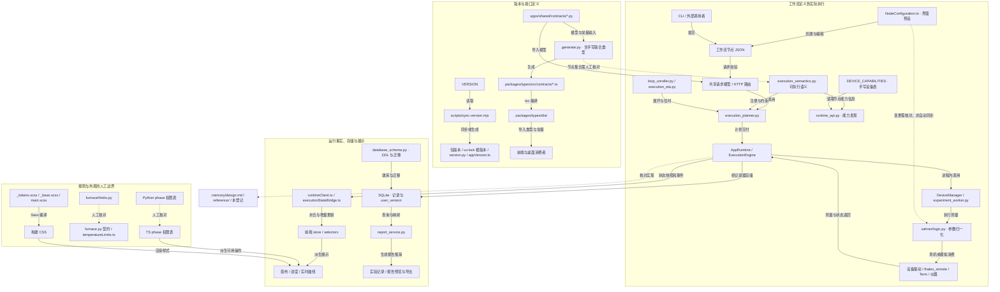

> Thales / Term 研究已独立迁出；本文后续只管理应用项目的来源关系。

# 功能源头与派生关系

状态：当前来源登记与静态核查。归属：各模块维护者；文档维护者负责汇总。复核日期：2026-09-20。

范围：现有项目文档、主要定义和消费文件。Astra xhigh 子代理进行来源审计，主代理核对关键证据并整理。核查起点提交 `b084759`；工作区另有进行中的前端引导功能改动，本报告不将其视为已交付能力。未连接设备、未改变参数或运行逻辑，未据此宣称真机稳定性已验证。

## 怎样理解“源头”

同一个功能可以有不同职责的源头：契约定义允许什么形状，执行代码决定怎样运行，实时对象持有当前状态，数据库保存已经发生的记录。它们不是互相替代的四份定义。

| 类别 | 判定方法 | 修改方式 |
| --- | --- | --- |
| 定义源头 | 被生成器、调用者或校验器直接读取的规则 | 从这里修改，并检查下游 |
| 自动派生 | 有可定位的生成器、输入和输出 | 改输入后重新生成，不独立手改输出 |
| 人工维护 / 同步 | 内容相关但没有自动生成关系 | 明确各自职责，变更时逐处核对 |
| 运行事实 | 当前进程或设备确认的状态 | 由运行时产生，不从文档或旧缓存恢复物理事实 |
| 持久化事实 | 真实保存的定义、记录和测量产物 | 按身份读取；显示或报告不反向覆盖原始记录 |
| 展示与解释 | 从上述事实计算、筛选、描述的结果 | 不能冒充执行定义或原始测量 |

## 来源登记：一个功能从哪里开始，最后到哪里

下表路径相对仓库根目录。行号用于本次核查定位，后续以文件中的符号为准。表内“源头”限定在所写职责，不表示该文件拥有整个功能的所有规则。

| 功能 / 事实 | 定义或事实源头 | 中间文件与关系 | 最终体现 / 更新触发 |
| --- | --- | --- | --- |
| 应用版本 | [VERSION](../../VERSION) | `scripts/sync-version.mjs:6–45` 同步四个 package、pyproject、uv.lock 根版本，生成后端 `version.py` 及两份 `generated/appVersion.ts` | 后端健康与能力响应、包元数据；改版本运行 `pnpm version:sync`、人工写 CHANGELOG，再 `pnpm version:check` |
| API / 报告版本 | [protocol.py](../../apps/shared/contracts/protocol.py) 的 `API_VERSION` / `REPORT_VERSION` | `main.py` 构造 FastAPI 元数据；`runtime_api.py` 生成能力响应；`report.py` 定义报告版本字段 | OpenAPI、能力发现、报告载荷；与应用版本和迁移版本独立 |
| 跨端类型 | [共享契约目录](../../apps/shared/contracts) 与 `generate.py` 的手写模板 | `generate.py:98–128` 读取模型字段、alias 和输出要求；生成 `packages/types/src/contracts/`，`src/index.ts` 导出，tsc 编译为 dist | 前端通过 `@zahnerflow/types` 消费；修改契约须显式生成，普通 build 不执行 Python 生成器 |
| 事件名称 / phase 名称 | `contracts/events.py`、`workflow.py` 的 `EXECUTION_PHASE_VALUES` | `generate_events_ts`、phase 联合生成 → TS contracts → `eventContracts.ts`；Python 直接导入源常量 | 后端广播和前端订阅；名称自动同步，phase 的允许命令表另见下文 |
| 用户路径默认值 | [settings.py](../../apps/shared/contracts/settings.py) 的 `FilePathConfig` | `generate.py:344` 对默认模型 `model_dump` → TS `DEFAULT_FILE_PATH_CONFIG` → `UserContext.tsx` | 初始化/清空用户路径；这条自动链不覆盖节点测量默认值 |
| 节点是否可执行 | [execution_semantics.py](../../apps/python_backend/runtime/execution_semantics.py) 的 `NODE_EXECUTION_SPECS`、高级与结构节点集合 | Planner 校验源节点与展开节点；Engine 按 dispatch 分派；`runtime_api.py` 读取集合 | 实际可执行行为与能力发现；UI 联合类型不决定后端能力 |
| 界面新建节点 | [NodeConfiguration.ts](../../apps/frontend/src/types/NodeConfiguration.ts) 的 `NODE_CONFIGS`、展示表与分组 | `nodeUtilities.ts` 合并静态预设和用户 localStorage/session 预设 → `createWorkflowNode` → canvasStore → 编辑 config | 画布、属性栏、摘要；用户预设仅影响节点创建，不是后端缺省 |
| 工作流输入和身份 | `contracts/workflow.py` 的请求模型；[workflow_identity.py](../../apps/python_backend/workflow_identity.py) 的归一化与指纹 | `routers/executions.py` 先规划后归档；节点 type/config 生成指纹，忽略临时节点 ID；每次执行另存 workflow_snapshot | 保存的工作流、操作者与 commandSource；显示名称不定义身份，执行快照不覆盖原工作流定义 |
| 展开与执行计划 | [execution_planner.py](../../apps/python_backend/runtime/execution_planner.py) 的 `plan`，`loop_unroller.py` 的展开与验证 | 创建/预览/估算共用 Planner 实现；循环、块、高级节点与测量边界展开，产出 ExecutionPlan；Engine 消费这次执行的计划 | `useUnrollPreview`、展开窗口、实际步骤与报告索引；三次 HTTP 请求不保证复用同一对象，前端不另算执行顺序 |
| ETA 与倒计时 | [execution_eta.py](../../apps/python_backend/runtime/execution_eta.py) 的估算规则和历史时长 | recorder 仅对合格成功步骤学习 → SQLite `node_duration_estimates` → 下次计划预测 → 时间线/快照 | 前端倒计时；预测不是设备测量时长命令，也不是实测数据 |
| 普通测量参数 | [zahner/logic.py](../../apps/python_backend/devices/zahner/logic.py) 的别名表、缺省及 `normalize_measurement_parameters` | worker、真机、模拟器调用同一归一化；真机分派到 measure 方法，调用 thales_remote | 仪器测量及结果文件；与 UI 预设分开维护，真机路径转换只在调用边界 |
| 高级节点参数 | [loop_unroller.py](../../apps/python_backend/loop_unroller.py) 的高级展开和 `_float_config` | 先读原始 config 的别名/默认，再生成 chrono 子节点，之后进入测量归一化 | switching / step ramp 的实际子步骤；目前这部分没有自动复用 logic 的全部规则 |
| 活跃执行 / 设备连接 | [app_runtime.py](../../apps/python_backend/runtime/app_runtime.py)、`device_manager.py` 和实际设备对象 | AppRuntime 推进状态版本、记录并广播；DeviceManager 管理连接代次，直接导入真机/模拟类 | HTTP/Socket 快照 → runtimeClient → bridge / 设备 hooks → UI；重启前的 DB 快照不能证明当前物理连接 |
| 数据库结构与迁移 | [database_schema.py](../../apps/python_backend/database_schema.py) 的 `TABLES`、`SCHEMA_OBJECTS`、`SCHEMA_VERSION` 和迁移函数 | `database.py` 开库调用迁移；事务写入 schema，`PRAGMA user_version` 记录已应用版本 | SQLite 表、索引和健康响应；改结构必须有迁移，不能仅修改 TABLES 后指望已升级库自动补齐 |
| 已执行事实 / 报告 | SQLite 执行、步骤、警告、产物关联与实际测量文件；`report.py` 定义报告形状 | `execution_recorder.py` 存储 → `report_service.py` 查询并在历史读取边界归一化 → `ExecutionReport` → runtimeClient → `reportDataBuilder.ts` | 实验记录、预览和 PDF；前端按物理路径去重展示，后端保留不同节点的来源关联 |
| 实时曲线 | 仪器返回的 measurementData / eisDataReady，`workflow.py` 描述载荷 | AppRuntime 丰富执行身份 → `useMeasurementStream.ts` / `useEisData.ts` 内存缓存 → `MeasurementChart.tsx` | IVT / EIS 图；Nyquist 显示 `(z_real, -z_imag)`，nodesReset 清缓存；图表缓存不是永久归档 |
| CLI / 能力发现 | [CLI main.py](../../apps/zahnerflow_cli/main.py) 的命令映射；后端真实路由与语义表 | urllib client 发送 HTTP；`runtime_api.py` 混合读取模型/语义表及手写 `DEVICE_CAPABILITIES`；设备子命令在 `routers/devices.py` 手写分派 | CLI 输出、App 同步、OpenAPI；CLI 不导入 DB/驱动、不自行展开、不自动启动服务 |
| 样式与视觉规则 | [样式目录](../../apps/frontend/src/styles) 的 `_tokens.scss`、`_base.scss` 与模块；[视觉规范](../reference/design-system.md) 记录人工约束 | `main.scss` 按层加载 → Vite/Sass 输出 CSS；`check-design.mjs` 只检查定义范围 | 工作台与组件外观；Markdown 不生成 SCSS，静态规则不代替视觉检查 |

### 生成命令与可复现边界

| 目的 | 根目录命令 | 明确边界 |
| --- | --- | --- |
| 同步应用版本 | `pnpm version:sync` | 不写发布日志，不修改 API / 数据库版本 |
| 生成共享 TS 契约 | `uv run python -m apps.shared.contracts.generate` | 模型与生成器内手写模板共同决定输出；随后构建和核对实际载荷 |
| 编译共享类型 | `pnpm --filter @zahnerflow/types build` | 编译现存 TS，不自动运行上行命令 |

研究包不随 Git 分发。`tools/extract_research.py` 从安装包提取并生成 `indexes/manifest.json`；`extract_methods.py` 生成可检索副本、摘录与 SDK/项目代码快照；HAL 与按类型脚本生成反汇编、coverage 及部分报告。它们不是可运行替代驱动。`build_focused_reading.py` 产生历史 `focused/`，不能用来更新现行 `focus/` 的分类。

`extract_methods.py` 的 SDK/项目快照目录版本是脚本写定的，实际复制的是重跑时当前源码；重跑须核对版本、提交和哈希，不能用目录名证明来源。现存 coverage 或 validation 的“通过”仅覆盖其声明的完整性检查，不等于语义完全恢复或本次真机复测。

## 功能源头与派生关系图

实线明确标注生成、导入、调用或存储；虚线表示人工同步、解释或核查，不能理解为自动生成。目录治理图另见 [文档架构](../README.md)。

图中的设备调用是职责链，具体方法可能由 worker 调用 `DeviceManager` 获取的设备对象；不表示每一步均有一个独立服务。`logic.py` 不是网络服务。前端/桌面 `appVersion.ts` 是已生成产物，核查时未找到直接导入消费者，不能据此画出不存在的版本文字展示链。

## 核查结果：哪些已修正，哪些仍需代码层处理

### 本次已修正的文档问题

| 问题 | 处理结果 |
| --- | --- |
| 使用、研究、历史正文混在 doc 根目录 | 16 份正文归入 guides / reference / research / insight，增加统一目录和专题入口，修复引用 |
| README 与 INSTALL 各自维护操作说明，INSTALL 仍称 1.0.0、pnpm 8，并引用不存在的测试目录 | 操作集中到 INSTALL，按当前脚本和环境声明核对；README 保留概览与导航 |
| `.memory/design.md` 写 API 4.0.0，源码为 4.1.0 | 设计改为引用 `protocol.py` 的定义，不继续维护第二份当前数值 |
| 数据规范把 `PRAGMA user_version` 当成迁移定义 | 改为 `database_schema.py` 定义迁移，pragma 仅保存已应用版本 |
| 设计把高级展开参数概括为已完全统一 | `[设备-驱动调用]` 明确现有独立读取边界，保留禁止继续新增重复规则的要求 |
| 设计中旧执行 ID 过滤描述与新的外部执行快照规则冲突 | 完整快照以 runtimeId / snapshotSequence 接收；增量事件按 executionId 过滤，二者分开说明 |
| GEMINI 重复代理约束、历史链接指向已删除 TS 展开器 | GEMINI 仅指向 AGENTS；旧展开器引用改为明确历史路径，不伪造当前文件 |

### 仍然存在的人工维护边界与风险

下表不是“全部发现了故障”。它区分现有行为差异、重复维护与验证覆盖不足；本次未修改这些业务代码。

| 项目 | 已核实的证据 | 后续维护要求 |
| --- | --- | --- |
| 节点类型分散 | `workflow.py:17` 的 NodeType 是 str；`generate.py:246–264` 手写 TS 联合；`execution_semantics.py:83–135` 定义执行集合；`NodeConfiguration.ts:48` 手写 UI 配置 | 新节点同时核对四处。后端 `delay`、`ocp`、通用 `measurement` 等入口不一定属于 UI 枚举，不能仅比数量判定缺失 |
| 两套 EIS 初值确实不同 | UI 恒电位 EIS：0.1–300000 Hz、0.025 V、START_TO_MAX；后端空 config：10–100000 Hz、0.01 V、START_TO_MIN。分别见 `NodeConfiguration.ts:110–123` 与 `logic.py:108–119` | 完整 UI 参数覆盖缺省，CLI/API 省略字段才使用后端缺省；是否统一需明确产品选择，不能从文档自动改测量参数 |
| 其他入口也有缺省差异 | UI chronoamperometry 采样 0.1 s、后端 common 为 1 s；UI voltage_ramp 为 -0.5→0.8 V / 130 s，后端为 0→1 V / 60 s | 维护参数说明时注明入口，不写无来源的“统一默认值” |
| 高级展开重复读别名 | `loop_unroller.py:171–278` 自行读 config、使用 `_float_config`，子节点还同时写 camelCase/snake_case；没有导入归一化函数 | 变更必须检查展开前后的参数；其统一属于后续代码任务，本次仅记录实际边界 |
| phase 权限表手工镜像 | Python `execution_semantics.py:37–45` 与 TS `executionStateModel.ts:77–85` 分别定义 active/terminal 和允许操作；本次逐项一致 | phase 名字虽自动生成，权限不会自动同步；改状态机需比较两表，类型覆盖不能证明规则一致 |
| 炉子约束至少三处 | `devices/furnace/limits.py:14–20`、`contracts/furnace.py:39–49`、`modules/furnace/temperatureLimits.ts:1–5` 都含数值约束 | 修改温度、段数或时间同时核对三处；用户 1–27 段与硬件 30 段含义不同，不能机械合并 |
| 构建没有证明契约同步 | `packages/types/package.json` build 只有版本检查与 tsc；所查构建/CI 入口未发现自动契约重生成及差异门禁 | 显式运行生成器并审查 diff；不能以 build 通过替代生成一致性检查 |
| 设备接口发现不完整反射 | `devices.py:42` 是多方法通配路由，内部手写子路径分派；AppRuntime 的 `DEVICE_CAPABILITIES` 也为手写 | 设备功能变更检查路由、能力表、驱动与客户端，不能声称 OpenAPI 列全每个设备操作 |
| 类型描述不等于输出强校验 | 设备 envelope 没有对应 `response_model` / `model_validate`；执行 snapshot 与报告 HTTP 则声明输出模型 | 分别记录校验覆盖，生成 TS 不会保留所有 Pydantic 数值限制，也不会自动校验运行数据 |
| 一部分版本产物尚无直接消费者 | 前端、桌面 generated/appVersion.ts 本次只找到定义；后端 version.py 确有消费者 | 这是未消费产物，不是版本冲突；不要把它描述成界面版本显示的源头 |
| 源码注释仍可能误导生成方向 | `workflow.py` 顶部保留“基于前端 Interfaces.ts”描述，但现在生成器读取 Python 定义输出 TS | 视为历史来源描述；实际修改方向以生成器为准，未来维护注释时纠正，不能倒过来改生成类型 |

### 本次验证与范围

完成了文档链接存在性、Mermaid 语法解析、版本一致性检查，以及关键源文件/生成写入点的交叉核对。现行筛选脚本已按新输出路径重跑，仍生成 728 条互斥分类及 22 个优先副本。详细命令与最终结果记录在 `.memory/changelog.md` 的 `[文档-架构与来源]` 条目。

未进行真机通信、全量契约重新生成对比、数据库迁移、应用构建或视觉验收。这些没有因纯文档整理而自动获得验证。本登记里的参数差异和人工同步点仍是后续维护要求，不是已经修复的代码。

## 后续维护规则

1. 新增一个功能，先登记其定义文件、符号、消费者、生成命令及最终展示；没有生成器的关联写“人工同步”。仅列文件名不能证明来源。
2. 新增节点同时核对契约生成器、执行语义、界面配置、高级展开和设备参数。界面可选并不证明后端可执行，TypeScript 类型通过也不证明 Python 已接受该语义。
3. 协议变更先改契约定义，再显式运行生成器、审查输出并构建。接口类型不代替路由实际校验；新增设备端点要同时核对路由分派与能力发现表。
4. 改默认值必须说明改的是“新建节点预设”还是“缺失参数时的后端行为”；未经确定不能把两者机械合并。高级节点的输入与展开后子节点分别核对。
5. 数据库结构改定义和迁移；`user_version` 是已应用版本记录。图表、报告、快照和缓存不得成为重新定义历史测量的依据。
6. 文档移动要检查生成器输出路径。研究材料同时记录原件、哈希、脚本、摘录和结论方向；缺少本地材料时标明无法复现，不能用报告代替原件。
7. 设计变化同步对应锚点和演进记录；完整文档流程见 [统一文档规则](../README.md)。本登记记录的代码风险需单独实现和验证，不因文档写清楚就视为修复。
