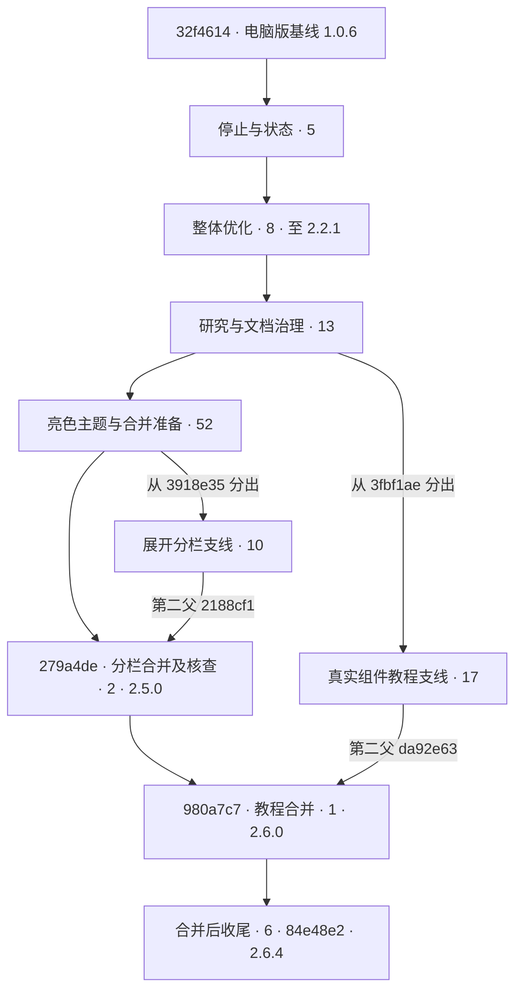

# 电脑版打包基线之后的更新与提交树

状态：研究结论（静态核查）。归属：本次更新核查。来源：本地安装包、Git 提交对象、逐提交差异、当前源码。复核日期：2026-10-07。

## 范围与证据

- 用户先要求最近 20 个更新，随后扩展到最近一次电脑版打包之前的提交。本报告使用当前本地 main 的祖先，不包含其他分支未合并的报告、电极面积或后续教程改动。
- 最新本地安装包：apps/desktop/release/ZAHNERFLOW Setup 1.0.6.exe，168620134 字节，修改时间 2026-07-17 11:07:57；对应 blockmap 修改时间 11:08:00。
- 高置信打包源码基线：32f4614，提交时间 2026-07-17 11:05:45，VERSION=1.0.6；下一提交 8090adf 在 11:47:02。子代理核对安装包 PE 版本、配套 app.asar 中的 package.json 与生成版本文件均为 1.0.6；配套前端产物包含该提交的指针捕获、进度环与禁用样式改动。产物未内嵌 Git SHA，未解包安装器逐字节核对载荷，不能排除构建时的未提交修改。
- 2.2.1 阶段确有后端打包及桌面壳编译证据，但 [当时报告](../insight/2.2.1/optimization-results-2026-09-08.md) 明确未重新生成最终安装器；不将它误记为后续电脑版发行。
- 固定终点：84e48e2（2026-09-21 14:52:40，VERSION=2.6.4）。本次报告提交不计入历史范围。
- 更新集合：git rev-list 32f4614..84e48e2，共 114 个；图另显示基线，共 115 个节点、116 条父子边。
- 文件差异分类：85 个代码提交、27 个纯文档提交、2 个合并提交。涉及代码及文档的混合提交只计为代码；不是新增功能数，也不是发行次数。
- 本次只核查并绘图，应用版本 2.6.4 → 2.6.4，不升级；原因是文档及历史分析，不产生可独立发布的应用功能。

## 阶段总览

| 路径／阶段 | 提交数 | 实际更新 |
| --- | ---: | --- |
| 主线：停止与状态 | 5 | 停止进度环、图表切换与曲线隔离、循环序号、统一执行状态与生命周期 |
| 主线：整体优化 | 8 | 前端职责、用户配置竞态、数据库迁移与报告契约、设计入口、CLI、报告加载及运行中编辑边界；含 3 个文档提交 |
| 主线：研究与文档治理 | 13 | Thales / Term 静态研究、来源链、目录治理、材料迁出；应用版本不变，不代表新增真机能力 |
| 主线：亮色主题与合并准备 | 52 | 玻璃层次、语义图标、背景多轮调整、动态网格渐变、个人偏好配色和主题联动；46 代码 + 6 文档 |
| 分栏支线 | 10 | Finder 分栏、子工作流直显、真实步骤号范围、去搜索、精简窗口、悬浮块；7 代码 + 3 文档 |
| 教程支线 | 17 | 从隔离展示演进到真实组件复用及状态恢复、取消放大、SOP 四章、Furnace/MFC 教程、阶段目录与布局 |
| 主线：分栏合并及核查 | 2 | 279a4de 合并分栏、升至 2.5.0；0946155 记录教程冲突 |
| 主线：教程合并 | 1 | 980a7c7 合并教程、主题与分栏，统一至 2.6.0 |
| 主线：合并后收尾 | 6 | 参数分块与单位、隐藏系统边界、逐行显示、标题与模糊、圆角统一、交接说明 |
| 合计 | 114 | 主线 87 + 分栏 10 + 教程 17 |

## 更新树

总览箭头表示阶段演进或支线合并；一个阶段框可以包含多个提交，不表示每个提交都直接拥有同一父提交。完整 SVG 按真实 Git 父子关系绘制，从下向上阅读。

本机产物（不随仓库克隆分发）：[总览 PNG](C:/Users/Dushuaijia/.codex/visualizations/2026/10/07/01a116d4-d509-7442-b663-2cebdf092abc/update-overview.png)、[总览 SVG](C:/Users/Dushuaijia/.codex/visualizations/2026/10/07/01a116d4-d509-7442-b663-2cebdf092abc/update-overview.svg)、[逐提交 SVG](C:/Users/Dushuaijia/.codex/visualizations/2026/10/07/01a116d4-d509-7442-b663-2cebdf092abc/full-update-tree.svg)、[可搜索 HTML](C:/Users/Dushuaijia/.codex/visualizations/2026/10/07/01a116d4-d509-7442-b663-2cebdf092abc/full-update-tree.html)、[节点与文件清单 JSON](C:/Users/Dushuaijia/.codex/visualizations/2026/10/07/01a116d4-d509-7442-b663-2cebdf092abc/expanded-commits.json)。

派生来源：Git 的 hash、parents、title、date、每个提交自己的 VERSION 和 diff-tree 文件清单。提取与绘图脚本位于忽略目录 .codex-run/update-tree/（expand.mjs、draw-overview.ps1、report.mjs），本机脚本与二进制产物不作为定义源。克隆后仍可按上述范围重建清单和本页 Mermaid。

## 已核实的问题（仅记录，不修改实现）

### 当前行为风险（静态路径确认，未动态复现）

- 旧深色偏好恢复可能出现深色界面配亮色网格背景：[appStore](../../apps/frontend/src/state/appStore.ts) 新增 backgroundPalette 的默认值是 mixed，旧持久化只有 theme=dark 时没有恢复归一化；[ParticleBackground](../../apps/frontend/src/components/ParticleBackground.tsx) 按 backgroundPalette 选择背景，而 main.tsx 按 theme 恢复界面。732d292 在重新选择配色时联动两者，但没有覆盖该旧数据恢复路径。
- 中途启动之前未执行的步骤可能显示“已完成”：后端 [execution_engine](../../apps/python_backend/runtime/execution_engine.py) 跳过起点之前的非前置步骤；[nodePhaseForDisplay](../../apps/frontend/src/state/executionStateModel.ts) 按当前位置推断此前节点 completed，[测量标签](../../apps/frontend/src/components/measurement-dashboard/MeasurementTabBar.tsx) 实际消费该状态。这是 0d4c8d3 保留的既有行为，不是本轮确认的新引入回归。

### 文档与审计覆盖问题

1. 编号定位描述过时：1e06f83 已删除定位入口及 jump/reveal；[当前设计](../../.memory/design.md) 的执行展开条目和 [组件注释](../../apps/frontend/src/components/UnrollViewModal.tsx) 仍称保留编号定位。
2. 系统边界展示描述过时：3cc1d68 在 [buildUnrollColumnTree](../../apps/frontend/src/components/unrollViewModel.ts) 过滤 automatic boundary、startup 和 shutdown；设计仍称可在界面检查。后端计划及真实执行索引仍保留，隐藏不等于删除执行步骤。
3. 语义色集中化声明过满：[画布状态背景](../../apps/frontend/src/styles/_canvas.scss) 的 node-status-bg 仍传入硬编码状态 RGB；[设备错误动画](../../apps/frontend/src/styles/_animations.scss) 仍用 rgba(220,38,38,...)。与 [视觉规范](../reference/design-system.md) “状态语义 RGB 已从 Sass 消费者收拢”声明不完全一致。设计检查通过仍不能排除此类未覆盖位置。
4. 教程侧栏比例描述不准确：[教程样式](../../apps/frontend/src/styles/_tutorial.scss) 使用 minmax(220px, 26%)，最大 660px 弹窗下 220px 下限使侧栏约占三分之一；[教学样式文档](../tutorial-style.md) 和当前设计仍写约 26%。这是静态 CSS 约束核对，未重新截图测量该应用页面。
5. 研究报告时态混用：[展开改版研究](unroll-modal-redesign-2026-09-20.md) 开头旧“当前布局”仍称分页双栏／窄屏上下布局，后文已记录 Finder 横向分栏、去搜索和窗口精简；应按历史阶段阅读，不能把开头当成终点实现。
6. 来源登记范围残留：[来源登记](../architecture/source-of-truth.md) 仍维护已迁出 Thales / Term 研究包的生成关系，与页首应用项目范围不一致。迁出提交 d70086e 不改变运行设备能力；本轮没有重验全部原件哈希。
7. 合并日志保留声明不准确：279a4de 的描述称保留双方日志，但相对第一父提交的实际差异删除／覆盖多段 CHANGELOG.md 和 .memory/changelog.md，终点未完全恢复；Git 历史仍保留原文。原分栏支线还曾有系统边界挂入分组后计数／范围漏算的问题，但终点隐藏边界后不能宣称仍按相同方式复现。

## 检查与限制

- 子代理 Laplace 完成打包基线核对、主线 24 个纯文档提交和 2 个合并提交检查；Euler 完成教程 17 个、分栏 7 个提交检查；Hilbert 完成原始 12 个代码提交和扩展主线 52 个代码提交检查。三位合计覆盖全部 114 个提交，分工无重叠。主代理负责范围、Git 父子边、版本读取、分类汇总、关键结论复核与绘图。
- 逐提交核对真实文件清单、版本与差异；大型重构深入代表差异及终点源码，不宣称逐行审完全部大型 diff。扩展主线只逐提交确认 VERSION，未逐提交复核全部派生版本字段；当前终点的版本字段由 version:check 验证。
- pnpm version:check：通过，应用版本字段一致为 2.6.4。
- pnpm design:check：通过，276 个核心令牌、Sass 入口及已统一组件检查通过；检查覆盖边界如上。
- 绘图结构：115 个节点、116 条边；114 个更新不重不漏；主线、分栏与教程 87+10+17=114；范围外父提交不存在。
- 总览 PNG 已目视检查；完整图浏览器渲染、980a7c7 与 32f4614 搜索定位、高亮和标题边界检查通过。
- 未重跑全部历史测试、重新打包或进行真机验证。本地现存产物不能单独证明其他目录或机器没有更新安装包。
- 核查文档与目录登记在交付时按项目规则创建中文 Git 提交；不改变运行拓扑、契约、数据库或应用版本。

## Furnace 两项问题专项核查（2026-10-07）

范围：用户确认故障发生于另一台电脑的 1.0.6 电脑版，当时错误提示未保存；继续分析，不要求补日志。只核对修复状态，不修改运行代码，不下发真机指令。

- 温度节点复用报错：没有找到针对“第一次执行正常、重置后炉子接收指令但工作流报错”的专项修复／真机验收。0d4c8d3 增加显式重置并清空取消、暂停等执行状态；新执行也清空这些标记。但不能将通用状态修改等同于具体故障根因已修复。当前温度执行在发出控制命令后还读回参数并确认设备状态，任何一步串口超时／异常仍可使工作流失败，即使设备已接受命令。未收到本次具体报错，不能确认该失败路径就是用户遇到的根因。
- 程序段显示错位：ProgramEditor.tsx 和共用 SegmentEditor.tsx 固定按三列重排 DOM，生成 C01、C10、C19、C02、C11、C20 等顺序；_furnace.scss 的 segments__grid 却是响应式 auto-fit，768px 以下明确为单列。只有恰好三列时才能形成纵向连续段号；一列时显示 C01、C10、C19、C02，四列时首行 C01、C10、C19、C02。该布局不一致在 1.0.6 和当前均存在，未找到后续专项修复。74b8aa2 引入固定三列 DOM 重排；旧 63b3478 曾改布局，但不能算当前问题已修复。本次未测量用户现场窗口实际列数，不能认定为现场错位的唯一原因。
- 段值／地址映射与显示排列应分开：前端按同一 segment.id 绑定标签和输入，后端读写都用 0x1A + (id - 1) × 2 映射温度地址，用 0x1B + (id - 1) × 2 映射时间地址。因此 C01=0x1A、t01=0x1B，C02=0x1C、t02=0x1D，静态映射一致，未发现段值或地址互换。没有进行真机读回验收。
- 打包前后差异：通过 Python AST 比较，当前与 32f4614 的 _execute_change_temperature、furnace_read_segments、furnace_write_segments、furnace_status、AI518PController._send 和 write_param 均相同；前端 ProgramEditor／PresetManager 也无差异。最近 114 个更新没有改写这些温控及段地址路径。
- 相关旧修复：a6c5222（2025-11-17）限制公开程序为 1-27，避免点变温保留段 28-30 地址冲突；f4ac62a（2026-07-16）修正温度节点程序时长与降温 ETA，均在电脑版 1.0.6 基线之前。不能将它们泛称为 C01/C02 顺序错位或重置后报错的专项修复。
- 验证范围：Git 差异、函数 AST、当前代码与历史记录；没有连接或控制真实 Furnace，也没有执行升温工作流。
- 新确认的具体失败路径：首次温度节点达到目标后返回成功，但没有停止炉子；若 Furnace runtime 的 executionStatus 仍是 running／paused 且 executionId 属于旧工作流，reset_execution_state 只重置工作流，不清除该炉子归属。第二次温度节点先写寄存器及运行命令，再调用 _finish_furnace_action；该方法因新旧 executionId 不同抛出 Stale Furnace execution event，使已发出命令的工作流失败。当前该方法与打包基线一致，此问题尚未修复。
- 隔离验证完成：uv run --no-sync python .codex-run/update-tree/furnace_repro.py，提取基线／当前的实际 reset_execution_state 和 _finish_furnace_action 函数，分别构造旧炉子 running／paused 状态；4/4 场景均确认工作流重置后保留旧炉子 executionId，并对新执行抛出 Stale Furnace execution event。没有连接设备。该路径符合用户现象，但缺少当次日志，仍不能认定为当次故障唯一根因。
- 子代理 Hilbert 复核重置／炉子执行归属失败路径，Laplace 复核段地址与响应式布局；主代理复核源码、基线差异并执行隔离验证。此次只补充核查文档，不修复业务代码；版本 2.6.4 → 2.6.4，不升级。

## 参数输入与右键删除专项核查（2026-10-07）

范围：延续用户 1.0.6 电脑版问题清单，只检查不修复业务代码。

- 对比 `32f4614` 打包基线与 `84e48e2` 当前业务源码；两个子代理分别检查输入组件和删除路径，主代理核对提交并进行隔离组件交互验证。未操作设备和用户持久化数据。

### 3. 参数框无法键入但可复制

**发现仍未修复的可复现输入卡住路径，但不能确认就是用户当时的具体故障。** `PropertyInputs.tsx` 两版的输入逻辑实质相同，仅增加教程定位属性。

- 温变速率 `rate` 和目标流量 `targetFlowRate` 允许单独输入 `.`；失焦时 `Number('.')` 得到 `NaN`，上下限处理没有检查有限数，组件显示 `NaN`。随后在其后直接键入数字，正则会拒绝包含 `NaN` 的新字符串，输入保持不变。源码位置：`PropertyInputs.tsx:262`、`:374`。
- 隔离浏览器验证使用两版真实 React 组件：上述两个字段均复现 `.` → 失焦 → `NaN` → 追加 `5` 无效；速率框全选替换为 `5` 后恢复。普通 `StandardInput` 两版均能逐字符键入 `-1.2e-3` 并在失焦后显示 `-0.0012`。验证脚本放在忽略目录 `.codex-run/update-tree/`，验证页与临时服务器已关闭。
- 目标温度仅接受整数；速率和流量仅接受一位小数，非法字符会静默拒绝。OCP 开启电池健康检查时，测量时长和采样间隔明确禁用并固定为 30 秒、1 秒，属于既有行为。
- 复制现有内容不触发输入校验，因此“可以复制”不能排除上述路径；本轮未验证剪贴板复制，也未把复制解释成粘贴。尚缺具体字段、原值、键入字符和界面状态，不能把所有无法键入都归因于此。
- 当前运行锁存在专用温度/MFC 控件未传递 `disabled` 的边界不一致，但该锁是后续新增，不能解释 1.0.6 原始问题。未发现基线中吞掉普通字符的全局键盘监听。

验证截图：`C:/Users/Dushuaijia/.codex/visualizations/2026/10/07/01a116d4-d509-7442-b663-2cebdf092abc/input-audit.png`。截图中的 old 为 1.0.6 源码基线，current 为当前组件，均非完整桌面程序。

### 4. 右键删除节点显示 undefined

**1.0.6 存在，当前源码已修复；尚未验证新版电脑版安装包。** 旧 `Canvas.tsx` 直接拼接 `node.name`，右键回调提供的 `DisplayNode` 没有顶层 `name`，名称在 `data.label`，因此确认提示出现 `undefined`。证据：`useLayout.ts:215`、`NodeRenderer.tsx:78`。

- `ae1ae0c`（2026-09-20，提交版本 2.3.1）改为按节点 id 找原始节点，再取 `NODE_CONFIGS[type].name`，同时改用 `ConfirmDialog`；`980a7c7`（2026-09-21，版本 2.6.0）将其合入主线。
- 当前 `Canvas.tsx:203` 使用 `NODE_CONFIGS[nodes.find(node => node.id === deleteNodeId)?.type ?? '']?.name ?? ''`，正常节点可得到正确名称；未知类型或节点已不存在时回退为空字符串，不显示 `undefined`。
- 修复来自后续源码提交，不会改变已安装的 1.0.6 程序。本轮仅核对源码、类型和历史差异，未在完整桌面程序中执行删除。

本轮仅更新核查文档并提交，不修改业务代码。应用版本 `2.6.4 → 2.6.4`，文档核查不升级版本。

## 分支合并状态复核（2026-10-07）

已执行 `git fetch origin --prune`。相对核查时主线 `399ac64`，现存两个本地分支尚未合并，不是一个：

| 分支 | 主线未包含的提交数 | 主要内容 | 分支头 |
| --- | ---: | --- | --- |
| `codex/report-improvements` | 24 | 报告布局、交互曲线、按温度分组导出、有效电极面积归一化、样品会话状态 | `e0dc80b` |
| `codex/simu` | 12 | 纯模拟版、公网演示限制与部署入口、部署验证文档 | `d179e9b` |

`git branch --no-merged main` 列出两者；`git cherry main <branch>` 全部显示 `+`，未找到与主线补丁等价的提交。报告分支从 `84e48e2` 分出，模拟分支与主线共同祖先为 `bd63b09`。刷新后远程仅有 `origin/main`，上述两者目前是本地工作树分支。

此前 114 条更新树只统计已经进入主线的历史，不含这两个分支。此次仅核查和更新文档，不执行合并或推送；应用版本仍为 `2.6.4 → 2.6.4`。

## 完整历史清单

后续实施任务（2026-10-07）：用户授权保留 `codex/simu` 为独立分支，先合并 `codex/report-improvements` 到主线，然后修复温度节点重复执行、Furnace 程序段顺序、参数输入卡住问题，并复核已修复的删除提示，更新应用版本并重新打包 Windows 电脑版。无冲突合并已完成（`f9cc5bd`），类型检查、设计规范检查及模拟炉重复节点回归通过；版本已同步为 2.11.2。用户追加要求合并后删除报告分支：计划将其干净工作树切为同一提交的 detached HEAD，保留目录和文件，再用 `git branch -d` 删除已合并分支。Windows 打包正在进行，尚未验收产物。

实施进展：`codex/report-improvements` 已安全删除，工作目录保留为 `e0dc80b` detached HEAD，`codex/simu` 仍为 `d179e9b`。上述专项核查中的“尚未修复”是实施前结论；现已修复可复现的 Furnace 归属与输入数值缺陷，并完成顺序布局修复。真实组件浏览器验证中，旧输入变成 NaN，修复后恢复默认并可继续键入 5.5/50.5；本次编译的完整应用右键显示“确定要删除节点‘等待’吗？”，确认后节点数由 2 变 1。首次安装包已生成并验证打包后端 2.11.2 能完成两次温度工作流，中间 reset，新 executionId 正确归属 Furnace，冻结面积和报告读取正常。侧面故障注入发现读状态期间取消仍可能发送启动命令，已补检查，正在重打包。最终验收未完成。

以下排列为 Git 反向拓扑顺序，不能当成提交时间线；真实祖先关系见完整图。每个版本来自对应提交的 VERSION。

| 提交 | 日期（北京时间） | 分类 | 版本 | 标题 |
| --- | --- | --- | --- | --- |
| 8090adf | 2026-07-17 | 代码 | 1.0.8 | 修复停止进度环绘制不完整 |
| f87651b | 2026-07-17 | 代码 | 1.0.8 | 调整停止进度环外圈样式 |
| 0ef2a32 | 2026-09-02 | 代码 | 1.0.9 | 修复测量图表切换与曲线隔离 |
| c78c745 | 2026-09-02 | 代码 | 1.0.10 | 修复循环进度序号显示 |
| 0d4c8d3 | 2026-09-02 | 代码 | 1.0.11 | 统一执行状态语义与曲线生命周期 |
| cbd8f58 | 2026-09-08 | 文档 | 1.0.11 | 文档：初始化项目入口与全局评估报告 |
| 27a5177 | 2026-09-08 | 文档 | 1.0.11 | 文档：固定整体优化基线与阶段验收范围 |
| 7e48c2e | 2026-09-08 | 代码 | 1.0.12 | 重构：精简前端职责与构建入口并修复用户配置竞态 |
| 47e4ed6 | 2026-09-08 | 代码 | 2.0.0 | 重构：统一数据库迁移和用户报告契约并升级至2.0.0 |
| 98dd0ac | 2026-09-08 | 代码 | 2.1.0 | 统一核心设计规范并重做执行步骤浏览窗口 |
| 7962539 | 2026-09-08 | 代码 | 2.2.0 | 新增命令行与代理接入并统一外部执行状态恢复 |
| 7b8828d | 2026-09-08 | 代码 | 2.2.1 | 收敛报告依赖与运行中编辑边界并完成集成验证 |
| bd63b09 | 2026-09-08 | 文档 | 2.2.1 | 文档：补齐整体优化交付节点与验收索引 |
| a68d0f6 | 2026-09-19 | 文档 | 2.2.1 | 文档：核查Thales 5.9.5通信逻辑与工作流改进项 |
| 9ab9a8d | 2026-09-19 | 文档 | 2.2.1 | 文档：分析Term到Zennium的USB驱动与心跳机制 |
| 837724f | 2026-09-19 | 文档 | 2.2.1 | 文档：并行研究Zennium直连HAL与D2XX两条路线 |
| 9391309 | 2026-09-19 | 文档 | 2.2.1 | 文档：提取测量方法并深入分析HAL通信与恢复机制 |
| b732bef | 2026-09-19 | 文档 | 2.2.1 | 文档：细分Thales核心文件与十个研究专题 |
| 3fbf1ae | 2026-09-20 | 文档 | 2.2.1 | 文档：按文件类型分批分析Thales材料并交叉核验 |
| b084759 | 2026-09-20 | 文档 | 2.2.1 | 文档：明确筛出22个Thales核心研究文件 |
| 4efc9bb | 2026-09-20 | 文档 | 2.2.1 | 统一项目文档架构并梳理功能源头与派生关系 |
| 7dd9cda | 2026-09-20 | 文档 | 2.2.1 | 将Thales反编译研究整理为独立子文档 |
| 284bdaa | 2026-09-20 | 文档 | 2.2.1 | 补充纯厂商反编译功能来源与真实调用链 |
| 4aa39ee | 2026-09-20 | 文档 | 2.2.1 | 明确每次答复文档先行并登记反编译范围核查 |
| e926d0f | 2026-09-20 | 文档 | 2.2.1 | 核清早期核心分析与728份原件的范围关系 |
| d70086e | 2026-09-20 | 文档 | 2.2.1 | 将Term与Thales反编译材料迁出为同级独立工作区 |
| 28826d7 | 2026-09-20 | 代码 | 2.3.0 | 新增基于现有玻璃界面的亮色主题与明暗切换 |
| df228f0 | 2026-09-20 | 代码 | 2.3.1 | 重设计专业冷灰亮色主题并保持组件布局尺寸 |
| 9747a58 | 2026-09-20 | 代码 | 2.3.2 | 增强亮色节点卡片与仪器工作台视觉层级 |
| 068a07b | 2026-09-20 | 代码 | 2.3.3 | 保留中性灰背景并恢复控件边界与局部色彩 |
| f8c7c74 | 2026-09-20 | 代码 | 2.3.4 | 提亮亮色模式的中性背景 |
| 31fcbf7 | 2026-09-20 | 代码 | 2.3.5 | 为亮色界面添加渐变粒子波浪背景 |
| 418cced | 2026-09-20 | 代码 | 2.3.6 | 恢复亮色工具栏和侧栏的磨砂玻璃效果 |
| 3ce2d3d | 2026-09-20 | 代码 | 2.3.7 | 为亮色常用操作图标增加语义配色 |
| 1d336f4 | 2026-09-20 | 代码 | 2.3.8 | 统一亮色主题的清新明亮配色 |
| ab1d6a3 | 2026-09-20 | 代码 | 2.3.9 | 调整亮色主题为适度饱和的多彩莫兰迪配色 |
| 4b88101 | 2026-09-20 | 代码 | 2.3.10 | 提升亮色图标色彩辨识度并修正就绪灯暗绿光晕 |
| 94a30e1 | 2026-09-20 | 代码 | 2.3.11 | 增加细丝颗粒波面并让亮色画布透出背景 |
| 726506e | 2026-09-20 | 代码 | 2.3.12 | 将海蓝垂落波浪接入亮色工作台背景 |
| c3e8183 | 2026-09-20 | 文档 | 2.3.12 | 记录展开步骤弹窗改版前现状 |
| 2f977e0 | 2026-09-20 | 代码 | 2.3.13 | 增加反向樱花粉与海蓝双向浪涌背景 |
| d8002dd | 2026-09-21 | 代码 | 2.3.14 | 柔化粉蓝三七浪涌并减少背景粒子绘制 |
| 3918e35 | 2026-09-21 | 文档 | 2.3.14 | 确认展开步骤采用访达分栏交互 |
| 5b016f1 | 2026-09-21 | 代码 | 2.3.15 | 调整粉蓝三五比例并恢复柔边浪涌轮廓 |
| d8395ae | 2026-09-21 | 代码 | 2.3.16 | 增强粉蓝交融并调整亮色背景明度与饱和度 |
| c11e629 | 2026-09-21 | 代码 | 2.3.17 | 微调亮色背景明度与饱和度 |
| 23300e8 | 2026-09-21 | 代码 | 2.3.18 | 分别调整粉蓝背景区域明度 |
| ef574d0 | 2026-09-21 | 代码 | 2.3.19 | 压暗粉色背景并消除粉蓝交界白带 |
| be9b5d0 | 2026-09-21 | 代码 | 2.3.20 | 恢复蓝色背景明度并保持柔和交融 |
| 485b88e | 2026-09-21 | 代码 | 2.3.21 | 降低蓝色背景饱和度并同步融合色 |
| 0632fb5 | 2026-09-21 | 代码 | 2.3.22 | 降低亮色背景整体不透明度 |
| d3431b0 | 2026-09-21 | 代码 | 2.3.23 | 将亮色背景替换为柔和多色动态网格渐变 |
| 413f549 | 2026-09-21 | 代码 | 2.4.0 | 新增亮色背景配色菜单并保存选择 |
| ced09a3 | 2026-09-21 | 代码 | 2.4.1 | 降低薄荷和樱粉背景不透明度 |
| c243c99 | 2026-09-21 | 代码 | 2.4.2 | 将背景配色移入个人偏好并使用渐变高光胶囊 |
| 8db3c23 | 2026-09-21 | 代码 | 2.4.3 | 删除顶栏亮暗主题切换按钮 |
| 732d292 | 2026-09-21 | 代码 | 2.4.4 | 恢复经典极光背景并联动完整深色主题 |
| 7ada40a | 2026-09-21 | 代码 | 2.4.5 | 统一个人偏好背景分组与现有设置页排版 |
| 8ffee13 | 2026-09-21 | 代码 | 2.4.6 | 将亮色通用工具图标恢复为黑灰层次 |
| eaa291c | 2026-09-21 | 代码 | 2.4.7 | 将亮色画布连接线和箭头改为深灰 |
| 18208aa | 2026-09-21 | 代码 | 2.4.8 | 修复浅色图表文字与浮层玻璃并柔化连接线 |
| 4cd9597 | 2026-09-21 | 代码 | 2.4.9 | 恢复浅色节点与属性分组的玻璃层级 |
| d56ecbb | 2026-09-21 | 代码 | 2.4.10 | 为亮色玻璃模块叠加两成白色遮罩 |
| 1cc4708 | 2026-09-21 | 代码 | 2.4.11 | 将亮色模块白色遮罩增强至三成 |
| db5f56a | 2026-09-21 | 代码 | 2.4.12 | 统一亮色工具控件的玻璃遮罩与状态反馈 |
| 1513069 | 2026-09-21 | 代码 | 2.4.13 | 修正属性和进度区为浅色白色遮罩 |
| e41a7b8 | 2026-09-21 | 代码 | 2.4.14 | 恢复浅色进度轨道与图表标签轮廓 |
| 80c3cc7 | 2026-09-21 | 代码 | 2.4.15 | 将图表分类按钮与数量徽标改为白色遮罩 |
| a61ab6a | 2026-09-21 | 代码 | 2.4.16 | 将浅色通知中心改为白色玻璃遮罩 |
| 6be662e | 2026-09-21 | 代码 | 2.4.17 | 统一亮色状态绿为单一主题变量 |
| bc0f5f7 | 2026-09-21 | 代码 | 2.4.18 | 全面统一前端语义颜色与主题变量引用 |
| aebaf4c | 2026-09-21 | 代码 | 2.4.19 | 恢复亮色工作站图标的黑灰配色 |
| 23492b6 | 2026-09-21 | 代码 | 2.4.20 | 提高亮色节点图标的语义色饱和度 |
| 138b43a | 2026-09-21 | 代码 | 2.4.21 | 统一个人偏好头像分组标题样式 |
| 22331f9 | 2026-09-21 | 文档 | 2.4.21 | 记录亮色分支合并冲突与范围核查 |
| af19c16 | 2026-09-21 | 文档 | 2.4.21 | 澄清亮色分支继承历史与实际修改范围 |
| 9ad1c7f | 2026-09-21 | 文档 | 2.4.21 | 记录二十个继承提交的改动分类 |
| c016b6e | 2026-09-21 | 文档 | 2.4.21 | 记录展开分栏分支合并障碍核查 |
| e45c76a | 2026-09-21 | 代码 | 2.3.15 | 将展开步骤重做为访达分栏视图 |
| 97bcfd7 | 2026-09-21 | 代码 | 2.3.16 | 展开步骤默认展开子工作流 |
| 78c6436 | 2026-09-21 | 代码 | 2.3.17 | 补充分组步骤号范围 |
| c672e20 | 2026-09-21 | 文档 | 2.3.17 | 明确分组序号显示位置 |
| f46ca49 | 2026-09-21 | 代码 | 2.3.18 | 统一展开窗口样式并移除搜索 |
| dfc6440 | 2026-09-21 | 文档 | 2.3.18 | 记录展开窗口最新截图 |
| 8cbe50f | 2026-09-21 | 文档 | 2.3.18 | 记录展开窗口深色截图 |
| 1e06f83 | 2026-09-21 | 代码 | 2.3.19 | 精简展开步骤窗口层级 |
| bf0bb99 | 2026-09-21 | 代码 | 2.3.20 | 移除展开分栏外层容器 |
| 2188cf1 | 2026-09-21 | 代码 | 2.3.21 | 将展开分栏改为悬浮块 |
| 279a4de | 2026-09-21 | 合并 | 2.5.0 | 合并展开步骤悬浮分栏并统一版本至2.5.0 |
| 0946155 | 2026-09-21 | 文档 | 2.5.0 | 记录教程分支合并冲突核查 |
| bfe0b36 | 2026-09-20 | 代码 | 2.3.0 | 新增隔离式全界面微教程并升级至2.3.0 |
| ae1ae0c | 2026-09-20 | 代码 | 2.3.1 | 教学复用真实组件及既有弹窗并完成逐步验收 |
| 1934ce9 | 2026-09-20 | 代码 | 2.3.2 | 修复教程重复启动并在当前页面隔离和恢复教学状态 |
| e311dc9 | 2026-09-20 | 代码 | 2.3.3 | 修复教程高亮残留并补齐压暗与真实控件放大 |
| 2cda4be | 2026-09-20 | 代码 | 2.3.4 | 将教学放大改为独立只读镜头并保持真实控件布局 |
| 594f838 | 2026-09-20 | 代码 | 2.3.5 | 移除教学局部放大并固定样式规范 |
| 1389d07 | 2026-09-20 | 代码 | 2.4.0 | 新增质子导体SOP四章综合实操教程 |
| 5d15ce0 | 2026-09-20 | 代码 | 2.5.0 | 完善实验信息校验教学并新增管式炉与流量计控制教程 |
| 2b0da07 | 2026-09-20 | 代码 | 2.5.1 | 移除教程预览视频并恢复编号步骤说明 |
| dbce696 | 2026-09-20 | 代码 | 2.5.2 | 将教程步骤序号改为圆圈连接时间线 |
| 1757a87 | 2026-09-20 | 代码 | 2.5.3 | 修复教程时间线圆圈与标题垂直错位 |
| 0bc938d | 2026-09-20 | 代码 | 2.5.4 | 将教程文字归纳为学习阶段并合并相关操作说明 |
| c47140c | 2026-09-20 | 代码 | 2.5.5 | 缩小教程弹窗并移除目录阶段数量 |
| 208d55d | 2026-09-20 | 代码 | 2.5.6 | 进一步收窄教程弹窗内容宽度 |
| 7faca99 | 2026-09-20 | 代码 | 2.5.7 | 将教程弹窗最大宽度调整为660像素 |
| ebac6c9 | 2026-09-20 | 代码 | 2.5.8 | 调整教程分类标题字号与右侧内容顶部间距 |
| da92e63 | 2026-09-20 | 代码 | 2.5.9 | 收紧教程分类标题与课程列表间距 |
| 980a7c7 | 2026-09-21 | 合并 | 2.6.0 | 整合真实组件教程与主线主题及展开分栏并升级2.6.0 |
| 3cc1d68 | 2026-09-21 | 代码 | 2.6.1 | 整理执行步骤详情分块与参数单位并隐藏系统边界 |
| f72db50 | 2026-09-21 | 代码 | 2.6.2 | 执行详情参数逐行显示并核实中途启动行为 |
| 12cca6c | 2026-09-21 | 代码 | 2.6.3 | 统一执行步骤展开标题及弹窗背景模糊范围 |
| bdf85be | 2026-09-21 | 代码 | 2.6.4 | 统一弹窗与侧栏外框圆角变量 |
| d2ce312 | 2026-09-21 | 代码 | 2.6.4 | 合并面板圆角变量并清理无用别名 |
| 84e48e2 | 2026-09-21 | 文档 | 2.6.4 | 补充界面调整会话交接说明 |
