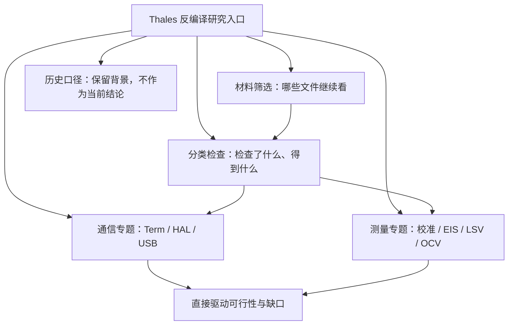
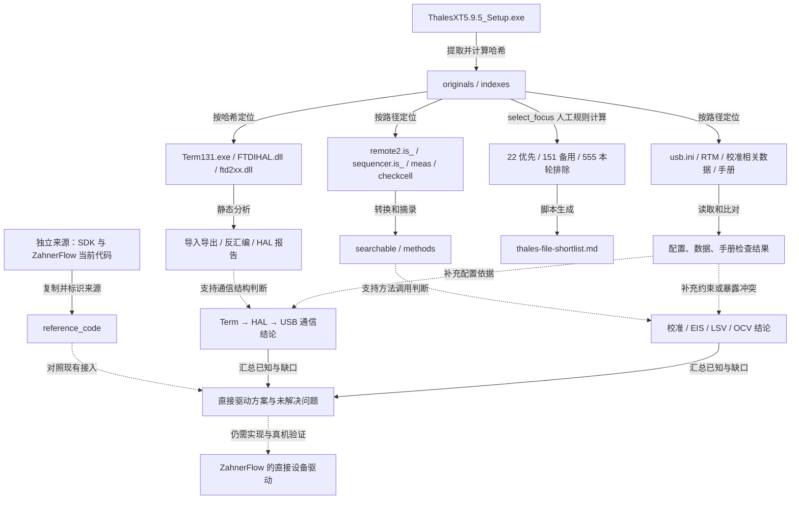

# Thales / Term 反编译研究：材料与功能来源

状态：研究材料整理。归属：设备通信研究。复核日期：2026-09-20。来源：本专题既有报告、安装包提取清单和分析脚本；本次没有新增反编译或真机验证。

本文是 ZahnerFlow 项目下独立的反编译研究子文档，只管理 Thales / Term 的材料、分析结果和来源关系。研究目的：找到通信、校准、EIS、LSV、OCV 所需的最小实现链，判断哪些能力可以直接接入 ZahnerFlow。本文不描述 ZahnerFlow 整体项目架构。

## 本专题的文档目录

```text
doc/research/thales/
├── README.md                              总入口：先看什么
├── reverse-engineering-map.md             本文：材料分工、来源与维护规则
├── thales-file-shortlist.md                哪些原文件继续研究
├── thales-file-type-analysis.md            各类型检查结果及未确认项
├── term-device-transport-review.md         Term 如何与设备通信
├── thales-595-communication-review.md       安装包与现有通信链的核查
├── thales-methods-and-hal-deep-analysis.md  测量方法、校准及 HAL 分析
├── zennium-direct-driver-feasibility.md    绕过 Term 的条件与缺口
└── history/
    └── thales-focused-reading.md           已替代的早期分类记录

archive/thales-xt-5.9.5-research/            本机证据包，不随 Git 分发
├── originals/                             提取出的厂商原件
├── indexes/                               原路径、文件清单与哈希
├── searchable/                            为检索转换的文本副本
├── reference_code/                        SDK 与 ZahnerFlow 源码快照
├── methods/                               按方法提取的阅读片段
├── analysis/                              HAL、各文件类型的分析与覆盖记录
├── focus/                                 现行筛选结果及 22 个优先副本
├── focused/                               历史筛选与专题产物
└── tools/                                 提取、转换、筛选脚本
```

## 研究文档架构图

箭头表示专题归属与阅读顺序。



## 哪些是原件，哪些是分析出来的

| 材料 | 在研究中有什么用 | 能否作为功能源头 |
| --- | --- | --- |
| 安装包与 originals 原件 | 确定该安装包实际包含的程序、脚本、配置和数据 | 是该版本分析的原始证据；不证明设备当前正在运行同一版本 |
| Remote2 / Sequencer / meas / checkcell 脚本 | 阅读命令处理、测量调用和校准过程 | 是所对应脚本版本的实现证据；不能把旧源码当成已匹配的新二进制源码 |
| Term、HAL、RTM、DLL | 检查调用、导出函数、传输和测量模块 | 原始二进制是实现证据；反汇编只是解释它的工具输出 |
| usb.ini、方法配置与二进制数据 | 判断选择哪个通信实现、参数如何传递、哪些数据被读取 | 配置与数据各有用途；未解码数据不能直接称作可用校准参数 |
| 厂商手册 | 解释接口和预期行为 | 文档证据；与代码或示例冲突时保留冲突，不能直接裁定真机行为 |
| searchable / methods | 方便搜索和按功能阅读 | 派生副本，可能改变编码、换行或只保留片段；不能独立运行 |
| reference_code | 对照当前 SDK 与 ZahnerFlow 接入方式 | 独立来源快照，不属于安装包；重跑必须核对实际版本和提交 |
| analysis / coverage | 记录检查内容、地址、工具输出和覆盖范围 | 派生产物；“覆盖完整”不等于“全部功能已还原” |
| focus 与筛选正文 | 明确下一轮优先读哪几个文件 | 人工筛选规则计算出的结果，不是程序必需依赖清单 |
| 研究 Markdown | 汇总证据、结论和缺口 | 人工解释或生成摘要；不能代替原件或已实现驱动 |

## 功能源头与派生关系图

实线注明提取、转换、生成或已有调用；虚线表示证据支持、待验证关联。不能将虚线读作已恢复完整协议。



## 各功能应从哪些文件开始

| 目标 | 优先原件 | 已得到的结果 | 仍不能宣称什么 |
| --- | --- | --- | --- |
| 设备通信 | `Term131.exe`、`FTDIHAL.dll`、`usb.ini`、`ftd2xx.dll`、`ftd2xx.h` | 已区分 SDK 到 Term 的 TCP 通道与 Term 到设备的 HAL/USB 通道，已有 HAL 生命周期和收发分析 | 调通 USB 库不等于替代 Term 的全部协议和文件服务 |
| 偏移校准 | `remote2.is_`、`meas141.is_`、`cc_nosin13.is_` 及相关数据 | 后续分类分析已定位 `chkcal` 与采样函数，早期“完全未找到算法”的表述已被补充 | 源码代表不等于当前加载版本；安装包校准数据不等于本机有效校准值 |
| EIS | `remote2.is_`、`im5.rtm`、EIS 手册 | 已定位命令、测量调用及保存结果链，确认仍涉及测量核心和主机文件服务 | 摘出调用片段不等于获得可单独运行的完整 EIS 实现 |
| LSV | `sequencer.is_`、相关规则和扫描示例、IE 手册 | 已分开研究 IE 与序列斜坡两条候选路径 | 候选路径不能未经验证就视为与现有扫描行为等价 |
| OCV / OCP | `remote2.is_`、`sequencer.is_`、`ocptest.seq` | 可从开路状态、读取电位和保持/采样步骤研究最小测量链 | 仍需核对时间、完成判断和中断恢复，不能只证明能读到一个值 |

具体证据和限定以 [分类分析](thales-file-type-analysis.md)、[方法与 HAL](thales-methods-and-hal-deep-analysis.md)、[直接驱动研究](zennium-direct-driver-feasibility.md) 为准。

## 本专题后续维护规则

1. 每个新增专题只回答一个明确问题，优先更新上述对应文件；不继续扩展整个项目的目录或运行架构说明。
2. 原件只引用路径与哈希；转换、摘录、反汇编另存，并记录输入、脚本与输出。修改阅读副本不视为修改原始实现。
3. 当前筛选以 `tools/select_focus.py` 生成的 `focus/` 为准。历史 `focused/` 不能覆盖现行口径；筛选不决定软件部署依赖。
4. 已证实、推断和待验证分开写。找到函数、覆盖全部文件、恢复可运行行为是三个不同结果。
5. 一条结论被新证据替代时在旧文档顶部链接新结论；不留下两个并列的“当前结果”。新增材料按文件类型分析，再按功能归入专题。
6. 与 ZahnerFlow 的关系只记录接入点、需要实现的接口及验证结果；正式实现之后才更新项目设备设计。
