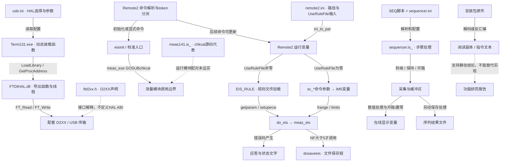

# Thales / Term 功能源头与反编译链路

状态：厂商软件静态反编译研究。执行：Astra xhigh 子代理，主代理交叉核对。日期：2026-09-20。

范围严格限定为 Thales XT 5.9.5 安装包中的 Term、HAL、设备脚本、运行模块、配置、规则和数据，以及由这些原件生成的反汇编与阅读副本。不分析现有项目代码、界面或接入方案，不以外部 SDK 作为本轮功能源头证据。未运行厂商程序或脚本，未加载 DLL，未连接或操作设备。

## 先看本轮新收获

- **Term 怎样加载通信库已追到实际指令。** 不再只靠文件名猜测；也找到初始化时传入的代码地址，纠正了将它猜成窗口句柄的风险。
- **配置文件不一定决定实际行为。** 有的值被代码写死后再允许命令覆盖，有的读取已注释，Remote2 缺失 INI 时还有默认项与读取位置错位。
- **校准有多条不同路径。** 初始化会触发即时偏移校准；保存校准文件、PAD4/附件校准另有入口，不能合并理解。
- **EIS 参数存在两套可选来源，而且设置顺序有影响。** 规则文件与命令参数由开关选择，模式操作还会清零交流幅值。
- **完成提示、显示值和文件不是同一结果。** EIS/IE 有独立保存条件；开路显示电流会置零，FIFO 导出走另一条路径。
- **仍未还原完整仪器协议。** 当前 RTM 内部、硬件原语、终端文件服务和真实加载版本仍有缺口，不能宣称已经得到可运行替代实现。

## 本轮材料和证据强度

旧清单为 7 个核心和 6 个配套，当前优先清单为 22 个，两者并集是 25 个不同原件。当前 22 个中，有 12 个不在旧的 7+6 清单中；“新筛选”不表示本次发现了新版本。主代理重新校验这 25 个原件及 22 份优先副本，并核对已有可检索文本的转换结果，均与原件及既有清单一致。

Astra 从 22 个当前优先文件出发，另沿明确引用检查 9 个依赖，形成 31 个对象的本轮功能证据清单。追加项包括测量/序列运行模块、一个历史 IM5 源码代表、三个规则文件和三个校准相关 BIN；追加理由逐项保存在清单中。旧清单中的 `meas.is_` 只纳入主代理输入校验，不能据此宣称其内部功能已全部分析。

- [输入校验](../../../archive/thales-xt-5.9.5-research/analysis/function_origins/input-audit.json)：原件与工作副本哈希、文本转换、旧新范围。
- [本轮功能证据清单](../../../archive/thales-xt-5.9.5-research/analysis/function_origins/origins-source-ledger.json)：31 个对象的来源、哈希、派生文本和二进制信息。
- [静态分析脚本](../../../archive/thales-xt-5.9.5-research/analysis/function_origins/origins_static_trace.py)：重新提取文本、Term 名称交叉引用及 HAL 指令片段；不执行厂商文件。
- [Astra 完整反编译报告](../../../archive/thales-xt-5.9.5-research/analysis/function_origins/ASTRA_FUNCTION_ORIGINS.md)：五项功能的函数标签、行号、地址、四张分链图和未恢复部分。
- [最终证据核验](../../../archive/thales-xt-5.9.5-research/analysis/function_origins/evidence-validation.json)：31 个功能分析输入的原件哈希未改变，派生文件存在；与输入审计合并共涉及 32 个不同原件，不代表 32 个都完成相同深度的反编译。

这些证据在本机研究包中，不随 Git 分发。正文中的脚本行号指此次已核对转换的阅读副本；二进制地址使用 RVA，必须连同具体文件理解，不能当作运行时地址。线性反汇编产生候选引用，不等于自动证明整个控制流可达。

| 关系 | 可以得出的结论 | 不能扩大的结论 |
| --- | --- | --- |
| 原件哈希相同 | 分析针对同一份字节 | 当前设备实际加载了它 |
| 源码中直接调用或赋值 | 该源码代表包含此逻辑 | 同名 RTM 一定由它编译 |
| PE 导入、导出和调用点 | 指定二进制存在该接口或指令关系 | 所有异常路径、物理意义均已恢复 |
| 字符串、版本标签、同名文件 | 提供继续追踪的候选 | 足以证明编译配对或调用关系 |
| 配置值与规则载荷 | 安装包携带这些状态和输入 | 都是推荐默认值，或都在运行时生效 |

## 已确认的源头优先关系

### 通信：配置选择实现，HAL 定义收发行为

`usb.ini` 提供 `HALDLL`、`FTDIHAL`、`CypressHAL` 等选择值。此次从 Term131.exe 原始字节重新定位到：RVA `0xC8C3D` 引用 `HALDLL`，`0xC8C78` 调用 `LoadLibraryA`，`0xC8C8F` 引用 `LinkIOInit` 名称，`0xC8C9A` 调用 `GetProcAddress`。因此“配置 → 动态加载 HAL → 取得导出接口”已有二进制调用证据，而不只是看到 DLL 名称。

装载函数既有读取 `SETUP/HALDLL` 的路径，也有读取传入配置键的路径；RVA `0xBC05D/0xBC067` 可选择 `FTDIHAL/CypressHAL`。因此一行 `HALDLL=` 还不能独立证明现场最终加载哪一个库。

HAL 的具体初始化、线程、管道及 D2XX 调用由 `FTDIHAL.dll` 决定。`ftd2xx.h` 描述 D2XX 接口，不能替代 HAL 的寄存器传参约定，也不能因存在 64 位 D2XX 库就将 32 位 Term/HAL 视为可直接换成 64 位。

此次还追到实际初始化调用：Term RVA `0xBC148` 经解析后的函数指针调用 `LinkIOInit`；传入 EAX 为 INI 指针，EDX 为 Term 内固定代码地址 **VA `0x4C16B8`**。它至少不是已证实的窗口句柄，更像回调候选，签名仍未恢复。扩展入口在 RVA `0xBC128` 调用 `LinkIOINITEx`，第三个寄存器 ECX 携带同一代码地址，EDX 另取对象值、其类型未证实。旧报告对宿主参数的猜测以本轮调用点证据为准，不能据此直接发布可调用 ABI。

### 校准：入口不止显式 CALOFFSETS 命令

Remote2 的 `eisinit` 中可见 `meas_exe("GOSUBchkcal")`，随后设置 `eis_init%=1`；显式校准命令是另一入口。`meas141.is_` 的 `chkcal` 可读到电流与电位偏移采样，但实际分支受 `gAL`、`pOT`、`selcal%` 等状态控制，不能称每次都无条件执行所有校准。

这里必须分开：触发校准的控制逻辑、`chkcal` 的算法源码代表、硬件原语，以及保存系数的文件。不能把发现的 `calfakj/k/l.bin` 直接当成全部偏移变量的已知序列化表；也没有证明 `meas141.is_` 与当前 `meas.rtm`、`im5.rtm` 一一配对。

中间调用不能用同名函数补齐：`meas141::chkcal` 开头从堆栈取六个值，Remote2 发出调用前没有直接压入这六个值；当前 `im5.rtm` 在文件偏移 `0xAD55` 出现 `chkcal` 字节，但其运行指令尚未解码。追加查看的历史 `im570906.is_` 没有 `chkcal`，只能辅助理解历史 `pcaln/frange`，不能证明当前校准跳转。

`meas141::loadcal/savecal` 才明确读取/写入 `CALIDATX`；即时 `chkcal` 没有直接调用 `savecal`。Checkcell 中的 `dc_calib/ac_save` 另有 PAD4 的 `AD4DC@`、`AD4K_<序列号>` 及附件 `.CAL` 路径，包含参考电阻和多项式处理。它们是不同校准功能，不能因为文件都带“cal”就合并。

### EIS：命令参数和规则文件是两条不同来源

Remote2 `token005` 的真实分支是：

- `uSErULEfILE% != 0`：加载 `EIS_RULE`，成功后 `getparam`、`setupecw`，再测量。
- `uSErULEfILE% == 0`：将 `sc_fMIN/sc_fSTART/sc_fMAX/...` 压栈传给 IM5 的频率相关变量，调用 `frange`、`limits` 后再测量。

安装包 `remote2.ini` 中 `UseRuleFile:0` 是输入证据；实际生效来源仍要结合加载和后续命令判断，不能只看文件里留有什么值。

切换模式还有副作用：在对应的非 FRA 分支中，`token099` 读取状态、设置 `gal` 后将 `aMPL=0`，经 `quittung2 → setupecw` 应用。`token098` 的源码注释说明旧模式参数不再主动决定模式，但该分支仍清零幅值。因此参数设置的先后顺序属于功能逻辑，不能把所有设置命令看成互不影响的键值更新。两个 token 对应原始表中的 `gAL=` 与 `gal=`；本轮保留原拼写与编号，不擅自合并，也未据此完整确定终端入口的大小写处理规则。

### 应答：配置中有键，不代表加载时采用该键

`ini_to_par` 从 `sup$(13)` 读取 `UseRuleFile`，却直接把 `gLOBALaCK%` 赋为 `2`，没有从相邻的 `sup$(12)` 读取。同一源码的 `token100` 又允许后续命令修改 `gLOBALaCK%`。因此应答模式的来源是“加载阶段硬编码初始化 → 后续命令可覆盖”，不是“INI 永久决定”，也不是“永远固定为 2”。

另外发现两处配置来源冲突：

- Remote2 `setdefaults` 把序列路径、名称、模式和序号填入 `sup$(12..15)`；`ini_to_par` 却按新布局把 `sup$(13)` 当作 UseRuleFile，并从 `sup$(14..17)` 读取序列配置。缺失配置时的回退数据布局与读取布局不一致。这里证实的是源码结构错位，尚未通过执行确定数值转换、错误处理和最终行为。
- Sequencer `initopar` 中，从 INI 读取 `online samples` 和 `interrupt frequency` 对应值的两条赋值已被注释。文件中的 `10` 和 `10K` 因此不能单独证明运行时使用这些值；要继续追其他初始化和计算位置。

### 版本标签：源码中的标签不能独立证明版本配对

Remote2 源码保留较早的 `version$`，内部又包含 2024-11-04 的模式处理改动注释。二者只能分别视为标签和修改记录证据，不能仅用前者给整份源码定年，更不能由此认定与某个运行模块等价。

## LSV 与 OCP：不同入口不能合并成同一种实现

厂商包中至少应区分 IE 曲线与 Sequencer 序列两条扫描路径：

| 功能入口 | 真正决定方法的地方 | 经过的处理 | 最终结果 |
| --- | --- | --- | --- |
| Remote2 IE 命令 | `token007` 选择规则或参数，`do_ie` 调用 `meas_ie` | 读取测量错误与 `CP%`、`PHASE%`，判断是否保存 | `dosaveie` → `meas_save_ie` → `ana_open_ie` / `ana_plot_ie` / `ana_xascii`；保存、绘图、ASCII 导出分别发生 |
| `ramp_pot_s` | Sequencer 指令表和 `do01` | 根据起终点及第三参数计算 `etime=ABS(pset2-pset1)/param3`，设置限值，再进入公共执行路径 | 采集缓冲、显示和序列结果；第三参数作为速率参与换算 |
| `ramp_pot_t` | Sequencer 指令表和 `do03` | 第三参数直接赋给 `etime`，其他起终点/限值由解析参数决定 | 同一公共采集框架；不能与速率版本仅凭名字互换 |
| `ocp` | Sequencer 指令表和 `do06` | `potentiostat=0`、`galvanostat=0`、清设点，`etime=param1`，进入公共执行路径 | 定时开路段的显示与数据处理；与单次电位读取不同 |

`ocptest.seq` 包含循环、保持、斜坡和 `ocp(2)` 的组合；它是方法输入示例，不定义 `ocp` 的执行算法。`sawtooth.seq` 调用的是 `ramp_pot_t`。真正的方法语义由 Sequencer 的解析与处理代码决定，不能从示例文件名反推整个方法。

IE 与 Sequencer 还有这些不可省略的中间层：

- IE 的 `pull_ie_param/push_ie_param` 在远程参数与测量核心之间对扫描速率/分辨率执行除以或乘以 1000 的单位转换。厂商 IE 又区分稳态、固定采样和动态扫描，不能把 IE 入口本身等同于 LSV。
- Sequencer 通过 `loadseqext/doseqext` 或自身界面进入 `doloops`，步骤处理后由 `setup_com` 构造参数块，`SYSsys1/SYSsys2` 与 IRQ/FIFO 参与执行。源码可见 SYS 编号 7/30/31，但尚未证明磁盘上哪个文件实现它们，不能仅凭 `.sys` 扩展名推断是 Windows 驱动。
- `samples()`、INI 的采样率、在线刷新量和 IRQ 时钟承担不同职责。某配置字段存在不等于被读取；序列命令还可修改采样参数。
- Remote2 `token003` 的普通电位读取和 `token012` 的平均读取没有在各自标签中关闭输出。**读到电位不等于仪器已进入开路状态**；定时 OCP 需追前述 `do06` 与公共执行/停止路径。

### 完成、显示和保存的不同来源

Remote2 `do_eis` 先依据测量错误码设置 `eis done` 或错误，再检查 `NF>5` 决定是否执行 `dosaveeis`。条件不满足时，记录 `NO DATA`、设置 `cmdstate%=0`，但不因这个分支重新改写先前的完成字符串。因此“测量完成应答”本身不是“文件已经产生”的证明。输出文件必须继续追保存分支、文件服务和写入结果。

IE 同样分开判定：`do_ie` 只有在 `CP%>10` 且从 `PHASE%` 取得的 `st_pHASE%>-1` 时进入 `dosaveie`。应答字符串、记录点数、文件和绘图各有自己的产生条件。

Sequencer 的 `ramp_pvimess` 先从缓冲区读取 `i`、`u`，在 `pot%=0` 时又把用于后续处理的 `i` 赋为 `0`。所以界面上的开路零电流可能是软件规则产生的表达，不能拿这个显示值倒推原始采样电流确实为零。

而 `FNwritefifo` 的 TXT 写出直接读取 FIFO 电流，未出现上述显示置零操作；不能进一步推断导出也一定是零。底层 FIFO 生产者未完全解码。其时间还经过舍入与文本格式化，TXT 不是未量化的原始采样字节。

EIS 保存之后的 `ana_open_eis → ana_plot_eis → ana_xascii` 是另一个分析展示/导出阶段，原生文件、图形和 ASCII 不属于同一层。编号 65、`@` 路径语义以及 Term 完整文件服务字节协议仍未恢复。测量错误但点数足够也可能进入保存分支，故不能只凭“有文件”反推测量完全成功。

## 功能来源与派生总图

图中实线是有配置读取、函数调用或数据处理证据的关系；虚线是解释性证据或尚未证明的源码/二进制对应。这里没有将阅读副本或研究报告放在执行链的源头。

## 按功能登记 Source of Truth 与派生产物

| 功能 | 真正决定规则或数据的来源 | 依赖与派生结果 | 不能误作源头的材料 |
| --- | --- | --- | --- |
| 选择通信实现 | Term 的选择/装载代码与实际被读取的 INI 键 | DLL 句柄 → 函数地址 → 寄存器调用 | DLL 名称字符串、仅一行 HALDLL、分析报告 |
| 字节收发与恢复 | 指定版本 FTDIHAL 的线程、管道、锁、超时和恢复分支 | D2XX 调用、传输计数、错误标记 | D2XX 头文件不能定义 HAL ABI；计数前进不代表测量应答 |
| 即时偏移校准 | Remote2 触发逻辑；当前运行模块的实现仍需解码，meas141 提供算法代表 | 按状态采样 → 偏移/增益参数压栈返回 | 同名函数不能证明跨模块调用已闭合；calfak 文件尚未映射 |
| 保存校准数据 | 所示源码的 `loadcal/savecal` 字段顺序及设备专属文件 | CALIDATX 读取/写入；Checkcell 另有 PAD4/附件文件链 | 一次 `ok` 应答、即时偏移值、其他附件系数不能互相替代 |
| EIS 方法参数 | 执行时的 UseRuleFile 分支选择规则光谱或 `sc_*` 参数；测量核心解释它们 | 频率数组/约束 → 测量结果 → 有条件保存 → 分析显示和 ASCII | INI 不是完整频率方法定义；模式操作可能清幅值；规则文件不是纯空模板 |
| IE 动态扫描 | IE 模式、规则/参数选择与核心测量逻辑 | 单位换算、模式校验 → meas_ie → 有条件保存/绘图 | “IE”名称本身不保证动态扫描；速率数值脱离单位会改变含义 |
| Sequencer 斜坡/开路 | 解析后的步骤及 `do01/do03/do06`，公共执行、SYS/IRQ 核心 | 参数块 → FIFO/buff → 显示变量或格式化 TXT | `.seq` 示例不定义指令语义；`.ini` 注释掉的读取不决定运行值 |
| 结果与状态 | 错误码、点数、缓冲/文件服务各自的事实 | done/error、图形、日志、TXT/ASCII分别派生 | 完成字符串不证明文件存在；显示 0 A 不证明原始电流为零 |

## 冲突、疑点与未恢复部分

本轮确认了 Term 动态绑定与初始化参数、校准多入口、配置优先关系和结果分流；HAL 管道/短写/看门狗、长度返回和 NUL 长度函数属于对既有结论的原件重反汇编复核，不冒充全部是新发现。

| 问题 | 本轮结论 | 尚待核实 |
| --- | --- | --- |
| Remote2 缺省布局与读取布局不一致 | 源码中直接可见 | 无 INI 时字符串转数值和错误处理的实际结果 |
| 模式命令清零幅值、旧模式 token 仍有副作用 | 对应非 FRA 分支直接可见 | 现场加载版本及各运行状态效果 |
| IE 速率检查使用不同错误变量 | `check_ie_rest` 设置 `para_err%/act_result$`，未如相邻检查写 `error%`，而上层随后看 `error%` | 上游是否已阻断，不能直接宣称必然越界执行 |
| OCP 手册说无功能限值，公共轮询仍有停止检查 | “无该指令专用限值参数”不等于“无任何停止条件” | 跨阶段限值标志的完整重置，不据局部代码断言泄漏 |
| 源码标签、注释与实现年代不一致 | 以具体赋值/调用为准，记录标签冲突 | 当前 RTM 的可信源码配对 |
| 即时偏移、PAD4/附件校准、calfak 数据混称校准 | 已分开触发、算法代表和文件路径 | 设备机号映射、硬件原语、未找到的现场校准文件 |

最主要的未闭合层是：Term 的完整主机服务和仪器帧/启动握手、RTM 指令格式与当前模块对应、`meas_exe` 的中转、SYS 7/30/31 的实际实现及 FIFO 生产者、原生文件序列化和设备专属校准数据。以上关系在分链图中标为缺口，没有用同名文件或旧源码拼成“完整实现”。

## 验证与维护

本轮只读静态检查。原件哈希、派生文件存在性及输入文本一致性均已核对；Mermaid 与相对链接另做语法/存在性校验。未进行硬件通信、校准写入、测量执行或恢复试验，不能据这些结果断言某个卡死原因已被实机证明。

继续反编译时从上述缺口挑选明确调用点，保留原路径、哈希、函数标签/地址、证据类型和未证实箭头。新增报告按功能链维护，不用文件数量代替恢复程度，也不将此报告扩展为其他软件的接入或架构分析。
