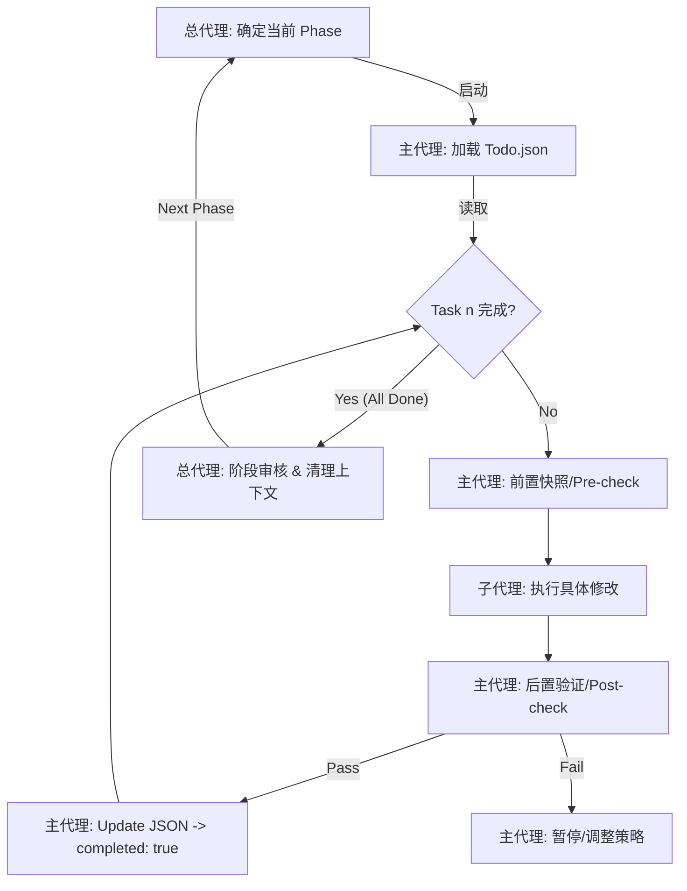

# ZAHNERFLOW Workflow 系统重构 - 三级代理执行协议

> **目标**: 将 3,500 行代码减少 70%，消除违背单一数据源原则的复杂中间层
> **核心理念**: 索引即顺序，数组即真理，后端即权威

---

## 第一部分：三级代理执行协议 (The Protocol)

### 1. 角色定义 (Roles)

#### 一级：总代理 (Total Agent / Architect)
- **职责**: 负责阶段（Phase）级别的调度
- **上下文**: **极简上下文**
  - 持有 `docs/talk.md` (全局架构规范)
  - 持有当前进行到第几个 Phase
- **动作**:
  1. 读取 `Todo_Phase_X.json`
  2. 启动主代理
  3. 待主代理完成该阶段所有任务后，进行最终核验
  4. 清空主代理的上下文，启动下一个阶段
- **权限**: 阶段间调度，拥有最高决策权

#### 二级：主代理 (Main Agent / Manager)
- **职责**: 负责当前 Phase 内的 Todo.json 列表执行
- **上下文**: **中等上下文**
  - 当前文件目录结构
  - `docs/talk.md` (全局架构规范)
  - 当前阶段的 `Todo.json`
- **动作**:
  1. **前置快照**: 读取目标文件/目录状态
  2. **派发任务**: 调用子代理执行具体原子操作
  3. **后置验证**: 检查子代理产出
     - 文件是否存在
     - 代码片段是否匹配
     - 是否违反 talk.md 规范
  4. **状态更新**: 将 Todo.json 对应项改为 completed: true
  5. **冲突熔断**: 若验证失败，暂停并调整策略
- **权限**: 任务编排、前置验证、后置验证

#### 三级：子代理 (Sub Agent / Worker)
- **职责**: 执行具体的原子操作（如"删除文件"、"重写函数"）
- **上下文**: **一次性上下文**
  - `docs/talk.md` (全局架构规范)
  - 具体指令（单次任务）
- **动作**:
  1. 执行代码修改
  2. **冲突熔断**: 若指令违背 talk.md 或导致编译错误，立即停止并报错
  3. 执行完成后销毁
- **权限**: 仅执行具体原子操作，无决策权

---

### 2. 工作流循环 (The Loop)



**关键机制**:
1. **上下文隔离**: 每个代理只持有必要的上下文，防止溢出
2. **前后验证**: 主代理负责双重验证，确保符合架构规范
3. **任务原子化**: 每个任务只包含最小可执行单元
4. **熔断机制**: 发现违背talk.md时立即停止，防止错误扩散

---

## 第二部分：全局上下文 (Global Context)

### docs/talk.md - 架构宪法

所有代理必须遵守的"宪法"，包含：

1. **核心数据结构**
   - `WorkflowNode`: 仅 `id`, `type`, `data.parameters`
   - `WorkflowDefinition`: 线性有序数组 `nodes[]`
   - **索引即执行顺序**

2. **必须删除的文件**
   - `workflowParameterStore.ts` (违背单一数据源)
   - `workflowExecutionService.ts` (过时逻辑)
   - `workflowSyncUtil.ts` (无需Diff)
   - WorkflowManager中的IO方法 (前端不处理IO)

3. **必须重写的文件**
   - `WorkflowManager.ts`: 仅保留 `createEmpty` 和 `validate`
   - `executionStore.ts`: 基于索引而非ID

4. **交互逻辑**
   - **三钮分离**: Save As / Update / Run
   - **Run = Create if Null**: 无ID时后端创建并返回ID

5. **视图与拖拽**
   - 自动布局: 根据索引计算坐标
   - 拖拽即排序: 本质是数组 `splice` 操作

6. **交通层设计**
   - API: `POST /api/executions` 携带 `{workflowId?, nodes}`
   - WebSocket: `{i: number, s: string}` 基于索引

---

## 第三部分：任务清单结构

### Todo_Phase_1.json - 删除冗余文件

**目标**: 清理违背架构规范的代码

**任务清单**:
1. 删除 `services/stores/workflowParameterStore.ts`
2. 删除 `services/workflowExecutionService.ts`
3. 删除 `services/workflowSyncUtil.ts`
4. 更新 `workflowStore.ts` - 清理ParameterStore依赖
5. 更新 `workflowService.ts` - 删除IO相关方法
6. 扫描并清理其他文件中的ParameterStore引用

**预期结果**:
- ✅ 3个文件被删除
- ✅ 不再有任何对ParameterStore的依赖
- ✅ workflowService简化
- **代码量减少**: ~800行

---

### Todo_Phase_2.json - 重写核心管理器

**目标**: 重构核心逻辑，基于新架构

**任务清单**:
1. 重构 `WorkflowManager.ts` - 删除复杂逻辑，仅保留核心方法
2. 重构 `executionStore.ts` - 改用数组索引
3. 简化 `workflowService.ts` - 实现简单的Run逻辑
4. 更新类型定义文件 - 移除禁止字段

**关键变更**:

**executionStore重构前**:
```typescript
interface ExecutionState {
  nodeStatuses: Map<string, string>;  // 需要查找
  nodeResults: Map<string, any>;
  currentNodeId: string | null;
}
```

**executionStore重构后**:
```typescript
interface ExecutionState {
  nodeStatuses: string[];  // O(1)访问
  nodeResults: any[];
  currentNodeIndex: number | null;
}

// WebSocket处理
onExecutionUpdate({ i, s, d }) => {
  nodeStatuses[i] = s;  // 直接索引赋值
}
```

**预期结果**:
- ✅ WorkflowManager从1700行简化为~100行
- ✅ O(1)状态访问，无Map查找
- ✅ 类型定义符合规范
- **代码量减少**: ~1,600行

---

### Todo_Phase_3.json - 更新UI组件

**目标**: 实现自动布局和拖拽排序，完成最终验证

**任务清单**:
1. 更新 `WorkflowManagerUI.tsx` - 移除ParameterStore依赖
2. 更新 `WorkflowIdDisplay.tsx` - 简化显示逻辑
3. 更新画布组件 - 实现自动布局和拖拽排序
4. 更新主控制按钮 - 实现三钮分离逻辑
5. 最终验证 - 类型检查与架构符合性检查

**拖拽逻辑实现**:
```typescript
// 拖拽前
nodes = [A, B, C, D, E];
//          0  1  2  3  4

// 将节点D移到索引1
const newNodes = moveNode(nodes, 3, 1);
// 结果: [A, D, B, C, E]
```

**三钮分离逻辑**:
```typescript
// Run按钮核心逻辑
const handleRun = async () => {
  const result = await runWorkflow(currentWorkflow.id, nodes);

  // Create if Null: 首次运行后确立身份
  if (!currentWorkflow.id) {
    setCurrentWorkflow({ id: result.workflowId, nodes });
  }
};
```

**验证检查清单**:
- [ ] TypeScript编译通过，无错误
- [ ] `grep "position\|label\|next_node_id"` 无匹配
- [ ] `grep "temp_"` 无匹配
- [ ] `grep "useWorkflowParameterStore"` 无匹配
- [ ] `grep "exportWorkflow\|importWorkflow"` 无匹配

**预期结果**:
- ✅ 自动布局实现
- ✅ 拖拽排序实现
- ✅ 三钮分离逻辑正确
- ✅ 符合talk.md规范
- **最终代码量**: ~1,000行 (减少70%)

---

## 第四部分：执行指南

### 总代理启动命令

```bash
# Phase 1: 删除冗余文件
npm run agent:phase 1

# Phase 2: 重写核心管理器
npm run agent:phase 2

# Phase 3: 更新UI组件与验证
npm run agent:phase 3
```

### 主代理工作流程

```typescript
// 主代理伪代码
async function mainAgent(phase: number) {
  // 1. 加载阶段任务清单
  const todo = loadJson(`docs/Todo_Phase_${phase}.json`);

  // 2. 遍历每个任务
  for (const task of todo.tasks) {
    if (task.completed) continue;

    // 3. 前置快照
    const beforeState = takeSnapshot(task);
    console.log(`[Pre-check] 任务: ${task.content}`);

    // 4. 调用子代理执行
    let success = false;
    try {
      for (const action of task.actions) {
        await subAgent.execute(action, beforeState);
      }
      success = true;
    } catch (error) {
      console.error(`[Sub-agent Error] ${error.message}`);
      success = false;
    }

    // 5. 后置验证
    if (success) {
      const afterState = takeSnapshot(task);
      const verified = verifyChange(beforeState, afterState, task);

      if (verified) {
        // 6. 更新任务状态
        task.completed = true;
        saveJson(`docs/Todo_Phase_${phase}.json`, todo);
        console.log(`✅ 任务完成: ${task.content}`);
      } else {
        console.error(`❌ 验证失败: ${task.content}`);
        rollback(beforeState);
      }
    }
  }

  // 7. 阶段完成
  console.log(`🎉 Phase ${phase} 所有任务完成`);
  return true;
}
```

### 子代理原子操作

子代理支持以下原子操作类型:

#### 1. delete_file
```typescript
{
  "type": "delete_file",
  "target": "services/stores/workflowParameterStore.ts",
  "verify": "文件不存在"
}
```

#### 2. remove_import
```typescript
{
  "type": "remove_import",
  "target": "services/stores/workflowStore.ts",
  "pattern": "useWorkflowParameterStore"
}
```

#### 3. remove_method
```typescript
{
  "type": "remove_method",
  "target": "components/features/workflow/WorkflowManager.ts",
  "method_name": "exportWorkflow"
}
```

#### 4. replace_file
```typescript
{
  "type": "replace_file",
  "target": "components/features/workflow/WorkflowManager.ts",
  "new_content": {
    "preserve": ["createEmpty", "validateWorkflowConfig"],
    "remove": ["exportWorkflow", "importWorkflow", "convertToCSV"]
  }
}
```

#### 5. update_interface
```typescript
{
  "type": "update_interface",
  "target": "types/workflow.types.ts",
  "interface_name": "WorkflowNode",
  "remove_fields": ["position", "label"],
  "preserve_fields": ["id", "type", "data"]
}
```

#### 6. run_command
```typescript
{
  "type": "run_command",
  "command": "npm run type-check",
  "expect": "无编译错误"
}
```

---

## 第五部分：质量门禁 (Quality Gates)

### 每个Phase必须通过的门禁

#### Phase 1 门禁
- [ ] `workflowParameterStore.ts` 已删除
- [ ] `workflowExecutionService.ts` 已删除
- [ ] `workflowSyncUtil.ts` 已删除
- [ ] `useWorkflowParameterStore` 在代码库中无引用
- [ ] workflowStore不再依赖ParameterStore

#### Phase 2 门禁
- [ ] WorkflowManager.ts < 200行 (从1700行减少)
- [ ] executionStore使用数组索引而非Map
- [ ] WorkflowNode类型无`position`, `label`, `edges`字段
- [ ] 所有类型定义符合talk.md规范

#### Phase 3 门禁
- [ ] TypeScript编译通过
- [ ] 自动布局功能实现
- [ ] 拖拽排序功能实现
- [ ] 三钮分离逻辑正确
- [ ] Run按钮支持Create if Null
- [ ] 总代码量减少70% (目标: ~1,000行)

### 熔断条件

以下情况必须立即停止重构:
1. ❌ TypeScript编译出现任何错误
2. ❌ 发现了对`temp_`前缀的依赖
3. ❌ 发现了对ParameterStore的残留引用
4. ❌ 新增的代码违背部份章节的原则
5. ❌ 功能测试失败 (执行流程无法正常工作)

---

## 第六部分：成果度量

### 代码量对比

| 组件 | 重构前 | 重构后 | 减少 |
|------|--------|--------|------|
| workflowParameterStore.ts | 216行 | 0行 (删除) | -216 |
| workflowExecutionService.ts | 838行 | 0行 (删除) | -838 |
| workflowSyncUtil.ts | 962行 | 0行 (删除) | -962 |
| WorkflowManager.ts | 1,774行 | ~100行 | -1,674 |
| executionStore.ts | 171行 | ~80行 | -91 |
| workflowStore.ts | 58行 | ~40行 | -18 |
| WorkflowManagerUI.tsx | 499行 | ~200行 | -299 |
| WorkflowIdDisplay.tsx | 109行 | ~50行 | -59 |
| **总计** | **~3,500行** | **~1,000行** | **-71%** |

### 架构质量指标

| 指标 | 重构前 | 重构后 | 改善 |
|------|--------|--------|------|
| Store数量 | 3个 (含ParameterStore) | 2个 | -33% |
| 状态访问复杂度 | O(log n) Map查找 | O(1) 数组访问 | 10x+ |
| 数据流清晰度 | 复杂(多中间层) | 简单(直接传输) | ✅ |
| 职责分离 | 混乱(Run/Save混合) | 清晰(三钮分离) | ✅ |
| 编译时类型安全 | ❌ (临时ID绕过) | ✅ (严格类型) | ✅ |

---

## 第七部分：附录

### 文件清单

```
docs/
├── talk.md                    # 架构宪法 (所有代理必须遵守)
├── Todo_Phase_1.json          # 第一阶段任务清单
├── Todo_Phase_2.json          # 第二阶段任务清单
├── Todo_Phase_3.json          # 第三阶段任务清单
└── REFACTORING_PROTOCOL.md    # 本文档 (协议说明)
```

### 术语表

- **talk.md**: 架构宪法，不可违背
- **索引即顺序**: 数组索引定义执行顺序
- **三钮分离**: Save As / Update / Run职责分离
- **Create if Null**: Run时若null则创建并返回ID
- **O(1)访问**: 数组直接索引，无查找开销
- **所见即所跑**: 运行携带当前完整数据
- **后端即权威**: ID、持久化由后端主导

### 版本信息

- **协议版本**: 1.0.0
- **生效日期**: 2025-12-03
- **重构目标版本**: ZAHNERFLOW v2.0

---

**维护者**: 总代理 (Total Agent)
**最后更新**: 2025-12-03
