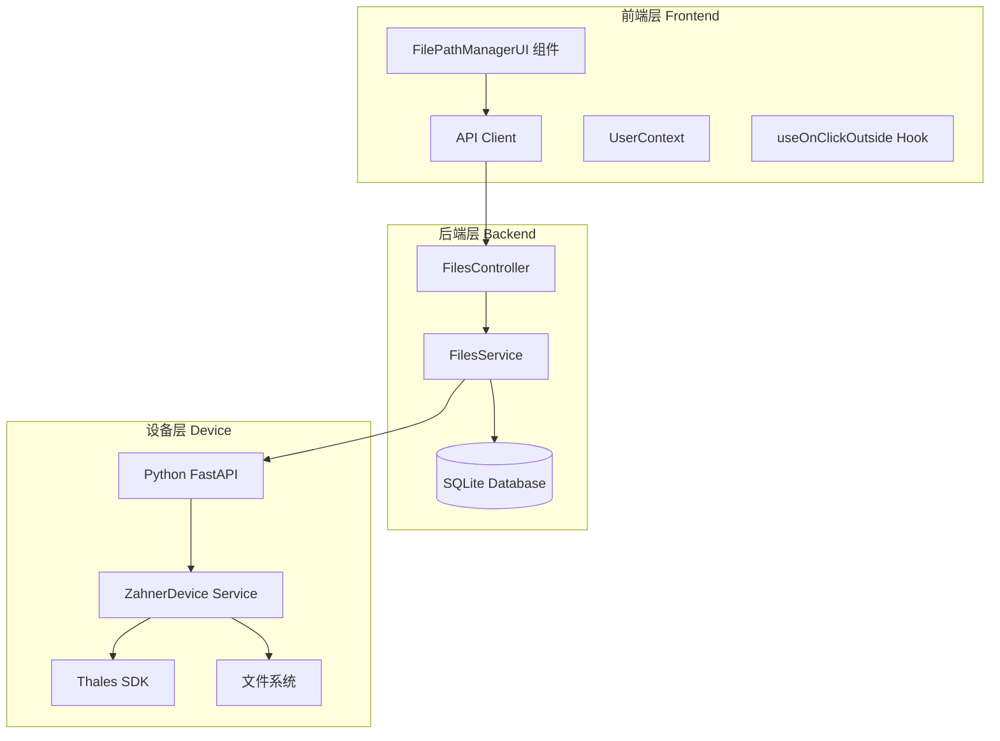
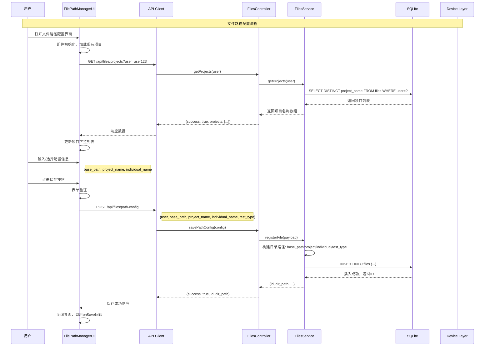
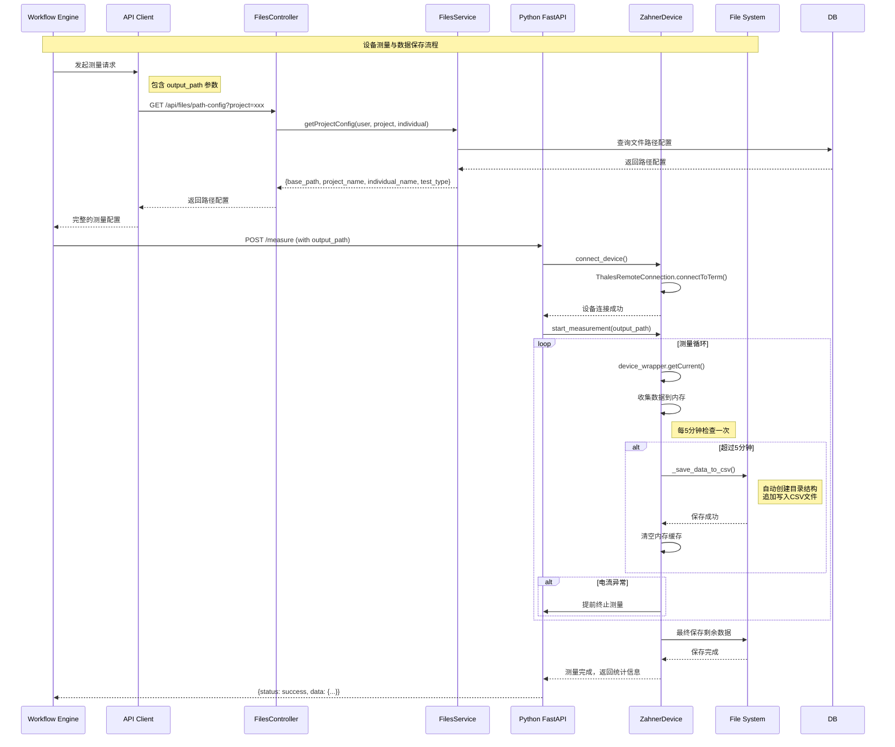
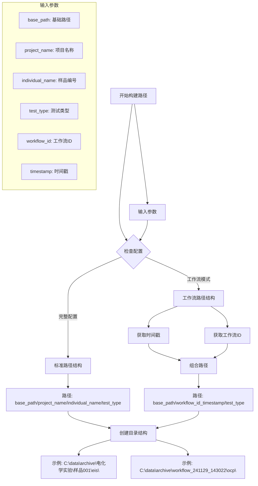
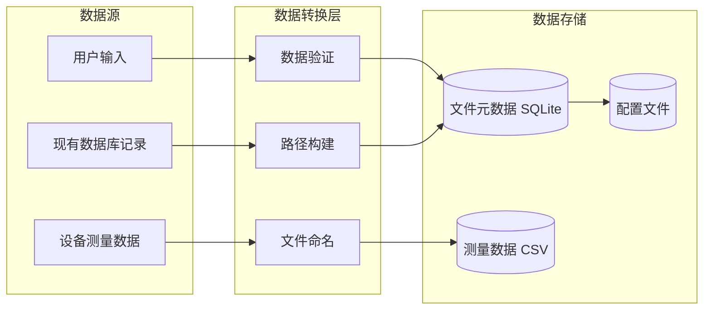
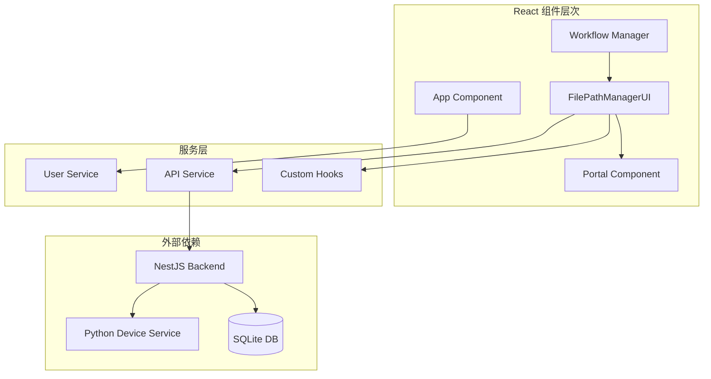
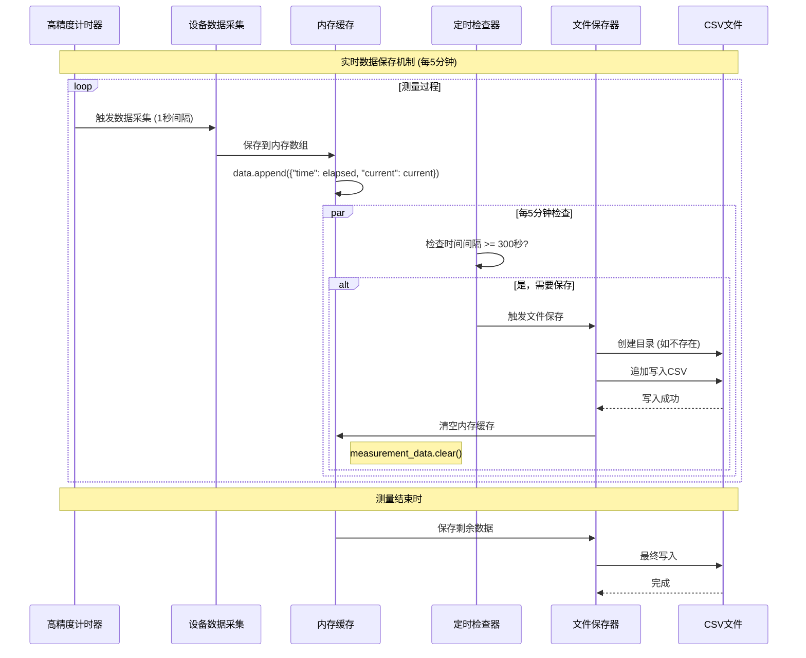

# ZAHNERFLOW 文件路径管理系统架构图

## 1. 系统整体架构图



## 2. 文件路径配置流程图



## 3. 设备测量与数据保存流程图



## 4. 目录结构构建逻辑图



## 5. 数据流架构图



## 6. 错误处理流程图

```mermaid
flowchart TD
    START[操作开始] --> TRY{尝试执行}

    TRY -->|前端验证失败| FRONTEND_ERROR[前端错误处理]
    TRY -->|API调用失败| API_ERROR[API错误处理]
    TRY -->|数据库操作失败| DB_ERROR[数据库错误处理]
    TRY -->|设备连接失败| DEVICE_ERROR[设备错误处理]

    FRONTEND_ERROR --> SHOW_UI_ERROR[显示用户界面错误]
    API_ERROR --> RETRY_API[API重试机制]
    DB_ERROR --> ROLLBACK[事务回滚]
    DEVICE_ERROR -> FALLBACK[降级处理]

    RETRY_API -->|重试成功| SUCCESS[操作成功]
    RETRY_API -->|重试失败| SHOW_UI_ERROR

    ROLLBACK --> SHOW_UI_ERROR
    FALLBACK --> SHOW_UI_ERROR

    SUCCESS --> END[操作结束]
    SHOW_UI_ERROR --> END

    subgraph "错误类型"
        VALIDATION_ERROR[表单验证错误]
        NETWORK_ERROR[网络连接错误]
        PERMISSION_ERROR[文件权限错误]
        DEVICE_OFFLINE[设备离线错误]
    end
```

## 7. 组件交互图



## 8. 实时数据保存机制图

